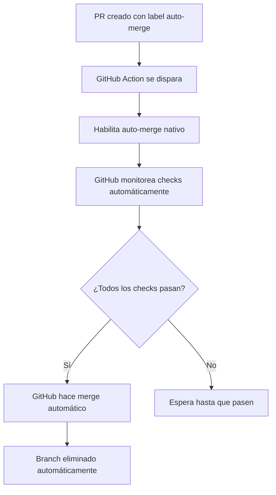

# Auto-merge Workflow Documentation (GitHub Native)

## Descripción General

El workflow de auto-merge utiliza la funcionalidad nativa de GitHub para gestionar el merge automático de PRs, eliminando la complejidad de scripts custom y aprovechando las características integradas de la plataforma.

## Migración Completada

**Fecha**: 2024-12-19
**Estado**: ✅ Migrado de custom a GitHub nativo
**Archivo Principal**: `.github/workflows/pr-automation.yml` (simplificado)

## Triggers del Workflow (Simplificados)

### Eventos Principales
- `pull_request`: [opened, labeled, ready_for_review]
- `workflow_dispatch`: Ejecución manual

### Eventos Eliminados (Ya no necesarios)
- ❌ `check_suite`, `check_run`, `status` - GitHub maneja automáticamente
- ❌ `schedule` - No necesario con auto-merge nativo
- ❌ `pull_request_review` - GitHub maneja automáticamente

## Funcionamiento con GitHub Nativo

### Requisitos Simplificados
1. **Label**: PR debe tener label `auto-merge`
2. **Workflow**: GitHub Actions habilita auto-merge nativo
3. **Checks**: GitHub maneja automáticamente las validaciones
4. **Merge**: GitHub ejecuta el merge cuando todo está listo

### Flujo Simplificado


### Ventajas del Enfoque Nativo
- ✅ **Menos código custom**: De 200+ líneas a ~30 líneas
- ✅ **Más confiable**: GitHub maneja la lógica internamente
- ✅ **Mejor UX**: Interfaz nativa en GitHub
- ✅ **Menos bugs**: No hay lógica custom que falle

## Comportamiento por Evento

### Eventos de PR Específicos
- **pull_request**: Procesa solo el PR del evento
- **check_suite/check_run**: Busca PRs por commit SHA
- **workflow_run**: Busca PRs por commit SHA del workflow

### Eventos Globales
- **schedule**: Escanea TODOS los PRs abiertos con label `auto-merge`
- **workflow_dispatch**: Igual que schedule, pero manual

## Proceso de Merge

### Método de Merge
- **Tipo**: Squash merge
- **Título**: `{PR title} (#{PR number})`
- **Cleanup**: Elimina la rama automáticamente

### Manejo de Errores
- **405**: PR no está en estado mergeable
- **409**: Conflicto de merge o rama modificada
- **Otros**: Log detallado del error

## Logs y Debugging

### Información Registrada
- Timestamp de ejecución
- Evento que disparó el workflow
- PRs encontrados y procesados
- Estado detallado de cada PR
- Resultado de checks y status
- Éxito o fallo del merge

### Ejemplo de Log
```
🔍 Starting unified auto-merge check...
Event: pull_request
🔍 event-triggered check: Found 1 PR(s) to check for auto-merge

🔄 Checking PR #30: feat: agregar validación de nombres de archivos
  - Author: cappato
  - Branch: feat/filename-validation-system -> main
  - Has auto-merge label: true
  - Is draft: false
  - Mergeable: true
  - Check runs: 3
  - All checks passed: true
  - Status state: success
  - Ready to merge: true
✅ PR #30 automatically merged
🗑️ Branch feat/filename-validation-system deleted
```

## Troubleshooting

### PR No Se Mergea

#### Verificar Condiciones
1. **Label**: ¿Tiene `auto-merge`?
2. **Checks**: ¿Todos pasando?
3. **Conflicts**: ¿Hay conflictos?
4. **Draft**: ¿Está marcado como draft?

#### Revisar Logs
1. Ir a **Actions** → **PR Automation**
2. Buscar ejecución reciente
3. Revisar logs del job `auto-merge`
4. Identificar qué condición falla

### Comportamiento "Aleatorio"

#### Causas Comunes
- **Múltiples workflows**: Conflictos entre workflows
- **Race conditions**: Eventos simultáneos
- **Timing**: Delays en GitHub Actions

#### Solución
- **Un solo workflow**: Este documento describe el unificado
- **Logs detallados**: Para identificar problemas
- **Backup scheduled**: Garantiza que nada se escape

## Mejores Prácticas

### Para Desarrolladores
1. **Agregar label** `auto-merge` solo cuando el PR esté listo
2. **Verificar checks** antes de agregar el label
3. **Resolver conflictos** antes del auto-merge
4. **No usar draft** si quieres auto-merge

### Para Mantenimiento
1. **Revisar logs** regularmente
2. **Monitorear rate limits** de GitHub API
3. **Actualizar permisos** si es necesario
4. **Documentar cambios** en este archivo

## Configuración de Permisos

### GitHub Actions Permissions
```yaml
permissions:
  contents: write      # Para hacer merge
  pull-requests: write # Para gestionar PRs
  checks: read        # Para leer checks
  statuses: read      # Para leer status
```

### Branch Protection
- **No requerido**: El workflow funciona sin branch protection
- **Compatible**: Funciona con branch protection habilitado
- **Recomendado**: Configurar required checks para mayor seguridad

## Monitoreo y Métricas

### Métricas Útiles
- **Tiempo promedio** de merge después de checks
- **Tasa de éxito** del auto-merge
- **PRs procesados** por día/semana
- **Errores comunes** y frecuencia

### Alertas Recomendadas
- **Fallos consecutivos** del workflow
- **PRs pendientes** por más de X tiempo
- **Rate limiting** de GitHub API

---

**Última actualización**: 2025-06-07
**Versión del workflow**: Unificado v1.0

<!-- Re-trigger para sincronizar checks de Cloudflare -->
