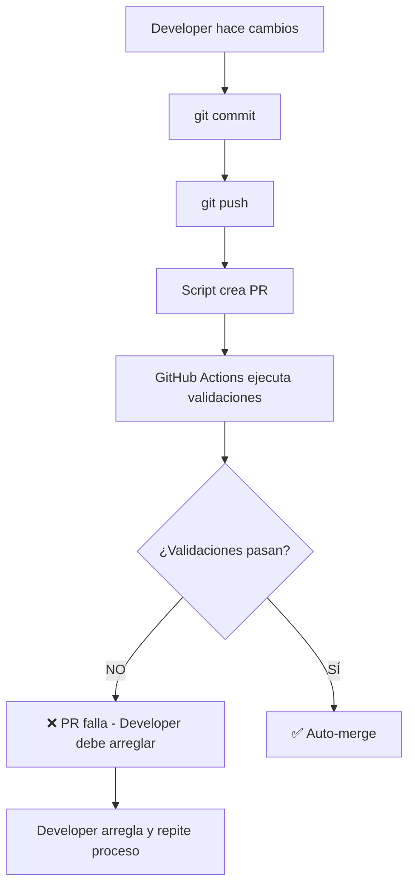
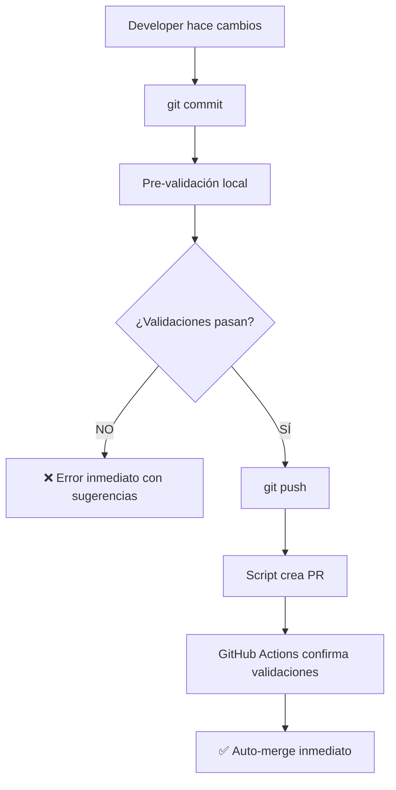

# Análisis de Validación: Proactiva vs Reactiva

## 🚨 PROBLEMA PRINCIPAL

**El sistema actual valida DESPUÉS de crear el PR, no ANTES.**

## 📊 FLUJO ACTUAL (REACTIVO)



### PROBLEMAS DEL FLUJO REACTIVO:

1. **Pérdida de Tiempo**:
   - PR se crea aunque vaya a fallar
   - Developer espera 2-3 minutos para saber si falla
   - Debe arreglar y repetir todo el proceso

2. **Experiencia Frustrante**:
   - "¿Por qué no me dijo antes que era muy grande?"
   - "¿Por qué creó el PR si sabía que iba a fallar?"

3. **Recursos Desperdiciados**:
   - GitHub Actions ejecuta tests innecesarios
   - PRs inválidos en el historial
   - Notificaciones spam

## 🎯 FLUJO IDEAL (PROACTIVO)



### BENEFICIOS DEL FLUJO PROACTIVO:

1. **Feedback Inmediato**:
   - Error en 1-2 segundos, no 2-3 minutos
   - Sugerencias específicas de cómo arreglar

2. **Experiencia Mejorada**:
   - No se crean PRs que van a fallar
   - Developer sabe inmediatamente qué arreglar

3. **Eficiencia**:
   - Solo se ejecutan GitHub Actions para PRs válidos
   - Menos ruido en el sistema

## 🔧 IMPLEMENTACIÓN PROPUESTA

### 1. Script de Pre-validación

```bash
# Comando que se ejecuta antes de crear PR
npm run validate:pr-ready
```

**Validaciones que debe hacer**:
- ✅ Tamaño del PR (archivos y líneas)
- ✅ Detección de emojis en código
- ✅ Nombres de archivos sin caracteres especiales
- ✅ Conventional commits
- ✅ Tests locales pasan

### 2. Integración con Workflow

```bash
# En lugar de:
git push && node scripts/create-pr.js

# Hacer:
npm run validate:pr-ready && git push && node scripts/create-pr.js
```

### 3. Validación Inteligente de Tamaño

```javascript
// Ejemplo de validación proactiva
function validatePRSize() {
    const files = getChangedFiles();
    const lines = getTotalLines();
    const prType = detectPRType();
    
    const limits = {
        'docs': { files: 12, lines: 400 },
        'docs+refactor': { files: 15, lines: 500 },
        'feature': { files: 10, lines: 300 },
        'default': { files: 8, lines: 250 }
    };
    
    const limit = limits[prType] || limits.default;
    
    if (files > limit.files || lines > limit.lines) {
        console.error(`❌ PR demasiado grande para tipo '${prType}':`);
        console.error(`   Archivos: ${files}/${limit.files}`);
        console.error(`   Líneas: ${lines}/${limit.lines}`);
        console.error(`💡 Sugerencia: Dividir en PRs más pequeños`);
        process.exit(1);
    }
}
```

## 📋 VALIDACIONES ACTUALES

### Reactivas (GitHub Actions):
- ✅ PR size check
- ✅ Conventional commits
- ✅ Tests automáticos
- ✅ Quality checks

### Proactivas (Git Hooks):
- ✅ Pre-push (protección de main)
- ✅ Commit-msg (conventional commits)
- ✅ Pre-commit (archivos grandes)

### FALTANTES (Críticas):
- ❌ Validación de tamaño de PR antes de crear
- ❌ Detección de emojis antes de push
- ❌ Validación de nombres de archivos
- ❌ Tests locales obligatorios

## 🚀 PLAN DE IMPLEMENTACIÓN

### Fase 1: Script de Pre-validación
1. Crear `scripts/validate-pr-ready.js`
2. Integrar con `simple-multi-agent.js`
3. Agregar a `package.json` como `npm run validate:pr-ready`

### Fase 2: Integración con Hooks
1. Modificar pre-push hook para incluir validaciones
2. Hacer validación obligatoria antes de push

### Fase 3: Optimización
1. Cache de resultados para evitar re-validaciones
2. Validación incremental (solo archivos cambiados)
3. Sugerencias inteligentes de cómo arreglar

## 💡 EJEMPLO DE USO

```bash
# Flujo actual (reactivo):
$ git push origin feat/mi-feature
$ node scripts/simple-multi-agent.js workflow
# → Crea PR
# → Espera 3 minutos
# → ❌ Falla por tamaño
# → Developer debe arreglar y repetir

# Flujo propuesto (proactivo):
$ npm run validate:pr-ready
# → ❌ Error inmediato: "PR muy grande (450 líneas > 300)"
# → 💡 Sugerencia: "Dividir en 2 PRs: docs + feature"
$ # Developer arregla inmediatamente
$ npm run validate:pr-ready
# → ✅ Validación pasó
$ git push && npm run multi-agent:workflow
# → ✅ PR creado y mergeado automáticamente
```

## 🎯 BENEFICIOS ESPERADOS

1. **Tiempo ahorrado**: 2-3 minutos por PR fallido
2. **Experiencia mejorada**: Feedback inmediato
3. **Menos ruido**: Solo PRs válidos en el sistema
4. **Eficiencia**: Recursos de CI/CD mejor utilizados
5. **Aprendizaje**: Developer aprende límites rápidamente
