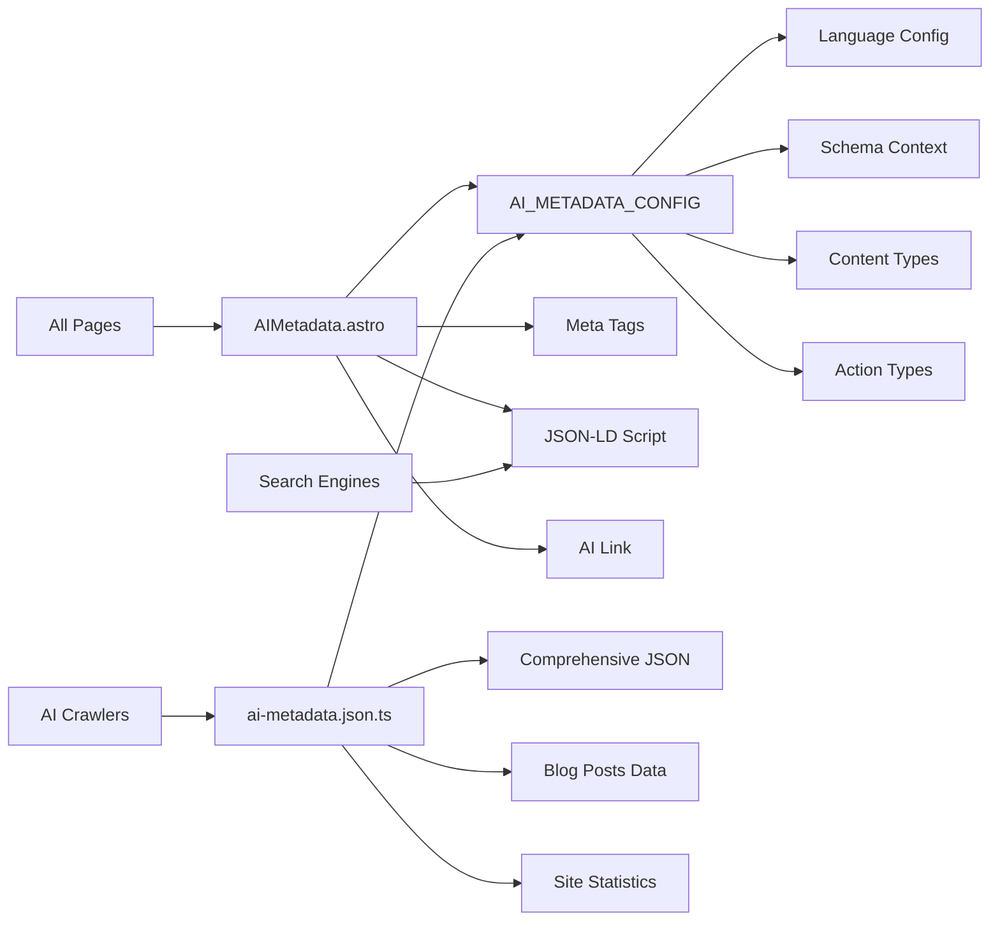

# AI Metadata System

## 🚀 **Resumen Ejecutivo**
Sistema completo de metadatos para asistentes de IA con generación automática de JSON-LD, meta tags específicos para IA y archivo ai-metadata.json. Proporciona información estructurada sobre el sitio, contenido y configuración para optimizar la comprensión por parte de asistentes de IA y crawlers.

**Arquitectura:** Configuration-Driven + JSON-LD Generation + Meta Tags + API Endpoint



## 🧠 **Core Logic**

### **1. Centralized AI Configuration**
```typescript
// AI_METADATA_CONFIG in src/config/site.ts
export const AI_METADATA_CONFIG = {
  // Language configuration
  language: 'es',
  
  // Schema.org context
  schemaContext: 'https://schema.org',
  
  // Default accessibility
  isAccessibleForFree: true,
  
  // AI metadata file path
  metadataFilePath: '/ai-metadata.json',
  
  // Meta tag prefixes
  metaTagPrefix: 'ai:',
  
  // Author configuration
  author: {
    type: 'Person',
    name: SITE_INFO.author.name,
    url: `${SITE_INFO.url}/about`
  },
  
  // Action types
  actionTypes: {
    read: 'ReadAction',
    view: 'ViewAction',
    search: 'SearchAction'
  },
  
  // Content types mapping
  contentTypes: {
    website: 'WebSite',
    article: 'BlogPosting',
    profile: 'Person',
    blog: 'Blog'
  }
} as const;
```

### **2. AIMetadata Component with Manager**
```astro
---
// src/components/seo/AIMetadata.astro
import { AI_METADATA_CONFIG } from '../../config/site.ts';

interface Props {
  title: string;
  description: string;
  type: 'website' | 'article' | 'profile' | 'blog';
  url: string;
  datePublished?: Date;
  dateModified?: Date;
  tags?: string[];
  author?: string;
}

// AI Metadata Manager Class
class AIMetadataManager {
  private config = AI_METADATA_CONFIG;

  public generateStructuredData(props) {
    const baseMetadata = {
      "@context": this.config.schemaContext,
      "@type": this.getContentType(props.type),
      "name": props.title,
      "description": props.description,
      "url": props.fullUrl,
      "keywords": (props.tags || []).join(", "),
      "author": {
        "@type": this.config.author.type,
        "name": props.author || this.config.author.name,
        "url": this.config.author.url
      },
      "inLanguage": this.config.language,
      "isAccessibleForFree": this.config.isAccessibleForFree,
      "potentialAction": {
        "@type": this.config.actionTypes.read,
        "target": props.fullUrl
      }
    };

    // Add article-specific fields
    if (props.type === 'article' && props.datePublished) {
      return {
        ...baseMetadata,
        "datePublished": props.datePublished.toISOString(),
        "dateModified": props.dateModified ? props.dateModified.toISOString() : props.datePublished.toISOString(),
        "mainEntityOfPage": {
          "@type": "WebPage",
          "@id": props.fullUrl
        }
      };
    }

    return baseMetadata;
  }
}
---

<!-- AI-specific meta tags -->
<meta name="ai:description" content={description} />
<meta name="ai:keywords" content={tags.join(", ")} />
<meta name="ai:type" content={type} />
<meta name="ai:author" content={author || config.author.name} />

<!-- Link to AI metadata file -->
<link rel="ai-metadata" href="/ai-metadata.json" />

<!-- Structured data for AI (JSON-LD) -->
<script type="application/ld+json" is:inline set:html={JSON.stringify(structuredData)} />
```

### **3. Comprehensive AI Metadata JSON Endpoint**
```typescript
// src/pages/ai-metadata.json.ts
export const GET: APIRoute = async () => {
  try {
    const aiMetadata = {
      "@context": AI_METADATA_CONFIG.schemaContext,
      "@type": "WebSite",
      "name": SITE_INFO.title,
      "description": SITE_INFO.description,
      "url": SITE_INFO.url,
      "author": {
        "@type": AI_METADATA_CONFIG.author.type,
        "name": AI_METADATA_CONFIG.author.name,
        "url": AI_METADATA_CONFIG.author.url
      },
      "inLanguage": AI_METADATA_CONFIG.language,
      "isAccessibleForFree": AI_METADATA_CONFIG.isAccessibleForFree,
      "dateModified": new Date().toISOString(),
      
      // Technical information
      "technicalInfo": {
        "framework": "Astro",
        "language": "TypeScript",
        "buildDate": new Date().toISOString(),
        "features": [
          "Static Site Generation",
          "Blog System", 
          "SEO Optimization",
          "AI Metadata"
        ]
      },
      
      // AI-specific instructions
      "aiInstructions": {
        "preferredCitation": `${SITE_INFO.author.name} - ${SITE_INFO.title}`,
        "contentLicense": "All rights reserved",
        "crawlingPolicy": "Allowed for AI training with attribution",
        "primaryTopics": [
          "Web Development",
          "JavaScript",
          "TypeScript",
          "React"
        ]
      }
    };

    return new Response(JSON.stringify(aiMetadata, null, 2), {
      status: 200,
      headers: {
        'Content-Type': 'application/json',
        'Cache-Control': 'public, max-age=3600'
      }
    });
  } catch (error) {
    // Return fallback metadata on error
    return new Response(JSON.stringify(fallbackMetadata, null, 2), {
      status: 200,
      headers: { 'Content-Type': 'application/json' }
    });
  }
};
```

## 📌 **Usage**

### **Basic Page Usage**
```astro
---
import AIMetadata from '../components/seo/AIMetadata.astro';
---

<html>
<head>
  <AIMetadata
    title="My Page Title"
    description="Page description for AI"
    type="website"
    url="/my-page"
  />
</head>
</html>
```

### **Blog Post Usage**
```astro
---
import AIMetadata from '../components/seo/AIMetadata.astro';

const post = {
  title: "My Blog Post",
  description: "Post description",
  date: new Date(),
  tags: ["javascript", "web-dev"],
  author: "John Doe"
};
---

<html>
<head>
  <AIMetadata
    title={post.title}
    description={post.description}
    type="article"
    url={`/blog/${post.slug}`}
    datePublished={post.date}
    dateModified={post.updatedDate}
    tags={post.tags}
    author={post.author}
  />
</head>
</html>
```

### **Profile Page Usage**
```astro
---
import AIMetadata from '../components/seo/AIMetadata.astro';
---

<html>
<head>
  <AIMetadata
    title="About John Doe"
    description="Software developer and blogger"
    type="profile"
    url="/about"
    author="John Doe"
  />
</head>
</html>
```

## ⚙️ **Configuración**

### **AI Metadata Configuration** (`src/config/site.ts`)
```typescript
export const AI_METADATA_CONFIG = {
  /** Language configuration */
  language: 'es',
  
  /** Schema.org context URL */
  schemaContext: 'https://schema.org',
  
  /** Default accessibility setting */
  isAccessibleForFree: true,
  
  /** AI metadata file path */
  metadataFilePath: '/ai-metadata.json',
  
  /** Meta tag prefix for AI-specific tags */
  metaTagPrefix: 'ai:',
  
  /** Author configuration */
  author: {
    type: 'Person',
    name: SITE_INFO.author.name,
    url: `${SITE_INFO.url}/about`
  },
  
  /** Schema.org action types */
  actionTypes: {
    read: 'ReadAction',
    view: 'ViewAction', 
    search: 'SearchAction'
  },
  
  /** Content type mappings */
  contentTypes: {
    website: 'WebSite',
    article: 'BlogPosting',
    profile: 'Person',
    blog: 'Blog'
  }
} as const;
```

### **Generated AI Metadata File Structure**
```json
{
  "@context": "https://schema.org",
  "@type": "WebSite",
  "name": "Site Name",
  "description": "Site description",
  "url": "https://example.com",
  "author": {
    "@type": "Person",
    "name": "Author Name",
    "url": "https://example.com/about"
  },
  "inLanguage": "es",
  "isAccessibleForFree": true,
  "technicalInfo": {
    "framework": "Astro",
    "language": "TypeScript",
    "features": ["Static Site Generation", "Blog System"]
  },
  "aiInstructions": {
    "preferredCitation": "Author Name - Site Name",
    "contentLicense": "All rights reserved",
    "crawlingPolicy": "Allowed for AI training with attribution",
    "primaryTopics": ["Web Development", "JavaScript"]
  }
}
```

## 🛠️ **Extensión**

### **Adding New Content Types**
1. Add new type to `AI_METADATA_CONFIG.contentTypes`
2. Update AIMetadata component Props interface
3. Add specific handling in `generateStructuredData()` method

### **Custom AI Instructions**
```typescript
// Extend AI_METADATA_CONFIG
export const AI_METADATA_CONFIG = {
  // ... existing config
  customInstructions: {
    "crawlingFrequency": "weekly",
    "preferredSummaryLength": "150-200 words",
    "keywordDensity": "2-3%",
    "citationFormat": "APA"
  }
} as const;
```

### **Multi-language Support**
```astro
---
const language = Astro.currentLocale || 'es';
const aiConfig = {
  ...AI_METADATA_CONFIG,
  language: language
};
---

<AIMetadata 
  title={title}
  description={description}
  type="website"
  url={url}
  language={language}
/>
```

## 🔒 **Features & Capabilities**

### **AI-Specific Meta Tags**
- ✅ **ai:description** - Content description for AI
- ✅ **ai:keywords** - Comma-separated keywords
- ✅ **ai:type** - Content type (website, article, profile, blog)
- ✅ **ai:published** - Publication date (for articles)
- ✅ **ai:modified** - Last modification date
- ✅ **ai:author** - Content author

### **JSON-LD Structured Data**
- ✅ **Schema.org compliance** - Standard structured data format
- ✅ **Content type mapping** - Automatic Schema.org type selection
- ✅ **Rich metadata** - Author, dates, keywords, actions
- ✅ **Article enhancement** - Additional fields for blog posts

### **Comprehensive AI Metadata File**
- ✅ **Site information** - Complete site metadata
- ✅ **Technical details** - Framework, language, features
- ✅ **Content statistics** - Post counts, tags, reading times
- ✅ **AI instructions** - Crawling policies, citation preferences
- ✅ **Navigation structure** - Site sections and organization

### **Error Handling**
- ✅ **Graceful fallbacks** - Simplified metadata on errors
- ✅ **Validation** - Input sanitization and type checking
- ✅ **Caching** - Appropriate cache headers for performance

## 🤖 **AI Context Block**

```yaml
feature_type: "ai_metadata_system"
input_sources: ["site_config", "blog_posts", "page_metadata"]
output_formats: ["json_ld", "meta_tags", "ai_metadata_json"]
validation_method: "schema_org_validation"
error_patterns: ["missing_required_fields", "invalid_dates", "malformed_json"]
dependencies: ["site_config", "blog_post_system"]
performance_impact: "minimal_overhead"
ai_optimization: ["structured_data", "semantic_markup", "crawling_instructions"]
schema_compliance: "schema_org_standard"
architecture_pattern: "configuration_driven_manager"
caching_strategy: "1_hour_public_cache"
fallback_handling: "graceful_degradation"
```

## ❓ **FAQ**

**Q: ¿Qué es el archivo ai-metadata.json?**  
A: Es un endpoint que genera un JSON completo con toda la información del sitio estructurada para asistentes de IA y crawlers.

**Q: ¿Cómo funciona la integración con Schema.org?**  
A: El sistema genera JSON-LD automáticamente usando tipos de Schema.org apropiados para cada tipo de contenido.

**Q: ¿Puedo personalizar los meta tags para IA?**  
A: Sí. Modifica `AI_METADATA_CONFIG.metaTagPrefix` o extiende el componente AIMetadata.

**Q: ¿Qué pasa si hay errores en la generación?**  
A: El sistema tiene fallbacks que devuelven metadatos simplificados para mantener la funcionalidad.

**Q: ¿Cómo agregar soporte para nuevos tipos de contenido?**  
A: Extiende `contentTypes` en la configuración y actualiza el método `generateStructuredData()`.

---

**Archivos Clave:**
- `src/components/seo/AIMetadata.astro` - Componente principal de metadatos IA
- `src/pages/ai-metadata.json.ts` - Endpoint de metadatos completos
- `src/config/site.ts` - Configuración centralizada (AI_METADATA_CONFIG)

**Status:** ✅ Production Ready  
**AI Optimization:** ✅ Structured data + Semantic markup + Crawling instructions  
**Schema.org Compliance:** ✅ Standard JSON-LD format  
**Error Handling:** ✅ Graceful fallbacks + Validation  
**Performance:** ✅ Cached responses + Minimal overhead
