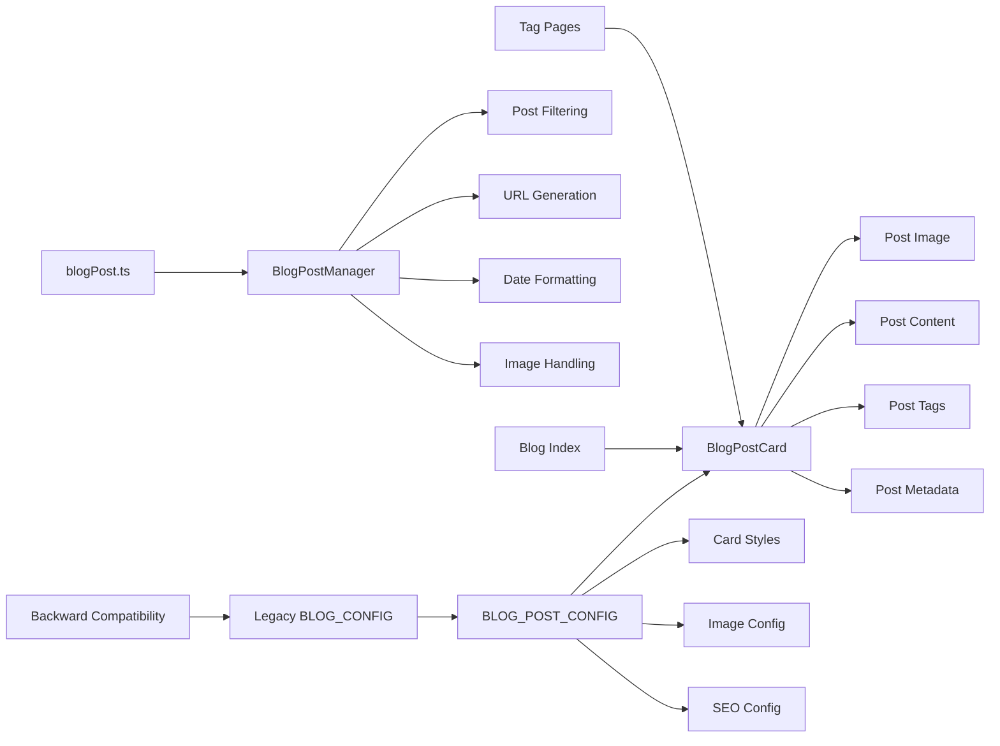

# blogPost Feature

## 🚀 **Resumen Ejecutivo**
Sistema unificado para renderizado y gestión de posts del blog con componente BlogPostCard centralizado, utilities configurables y configuración centralizada. Proporciona una interfaz consistente para blog index, páginas de tags y renderizado de posts con optimización de performance y SEO.

**Arquitectura:** Unified Component + Configuration-Driven + Utility Manager



## 🧠 **Core Logic**

### **1. Unified BlogPostCard Component**
```astro
// Single component for all blog post rendering
interface Props {
  post: BlogPostCardData;
  loading?: 'lazy' | 'eager';
  className?: string;
}

// Handles all post types with configuration-driven styling
<article class={`${styles.base} ${className}`}>
  {post.image ? (
    
  ) : (
    <div class={`w-full h-48 ${config.images.fallback.bgClass}`}>
      <span class="text-content">{config.images.fallback.text}</span>
    </div>
  )}
  <div class={styles.content}>
    <h3 class={styles.title}>
      <a href={post.url} class={styles.titleLink}>{post.title}</a>
    </h3>
    <p class={styles.date}>{post.formattedDate}</p>
    <p class={styles.description}>{post.description}</p>
    {post.tags && <TagList tags={post.tags} />}
    <a href={post.url} class={styles.readMore}>Leer más →</a>
  </div>
</article>
```

### **2. BlogPostManager Class Architecture**
```typescript
// src/utils/blogPost.ts
export class BlogPostManager {
  private config = BLOG_POST_CONFIG;

  public filterPosts(posts: BlogPost[]): BlogPost[] {
    return posts.filter(post => {
      if (!isValidPost(post)) return false;
      return shouldIncludePost(post);
    });
  }

  public transformToCardData(post: BlogPost): BlogPostCardData {
    return {
      title: post.data.title,
      description: post.data.description,
      date: post.data.date,
      formattedDate: this.formatPostDate(post.data.date),
      url: this.generatePostUrl(post),
      image: this.getPostImage(post),
      tags: post.data.tags || [],
      slug: post.data.slug || post.slug
    };
  }
}
```

### **3. Centralized Configuration System**
```typescript
// BLOG_POST_CONFIG in src/config/site.ts
export const BLOG_POST_CONFIG = {
  dateFormat: {
    locale: 'es-ES',
    options: { year: 'numeric', month: 'long', day: 'numeric' }
  },
  
  urls: {
    basePath: '/blog',
    tagBasePath: '/blog/tag'
  },
  
  images: {
    thumbnail: { width: 600, height: 315, format: 'webp' },
    fallback: { text: 'Sin imagen', bgClass: 'bg-muted dark:bg-muted-dark' }
  },
  
  cardStyles: {
    base: 'card-base overflow-hidden shadow-theme-lg hover:shadow-xl transition-all duration-200',
    image: 'w-full h-48 object-cover',
    title: 'text-xl font-bold mb-2',
    titleLink: 'text-primary hover:underline'
  }
} as const;
```

## 📌 **Usage**

### **Blog Index Page (blog/index.astro)**
```astro
---
import BlogPostCard from '../../components/blog/BlogPostCard.astro';
import { 
  getDisplayPosts, 
  transformPostsToCardData,
  getBlogSeoData 
} from '../../utils/blogPost.ts';

const allPosts = await getCollection('blog');
const posts = getDisplayPosts(allPosts);
const postCards = transformPostsToCardData(posts);
const { title, description } = getBlogSeoData();
---

<div class="grid grid-cols-1 md:grid-cols-2 lg:grid-cols-3 gap-8">
  {postCards.map((postCard, index) => (
    <BlogPostCard 
      post={postCard} 
      loading={index < 3 ? 'eager' : 'lazy'}
    />
  ))}
</div>
```

### **Tag Pages (blog/tag/[tag].astro)**
```astro
---
import BlogPostCard from '../../../components/blog/BlogPostCard.astro';
import { 
  getPostsByTag, 
  transformPostsToCardData,
  getTagSeoData 
} from '../../../utils/blogPost.ts';

const allPosts = await getCollection('blog');
const posts = getPostsByTag(allPosts, tag);
const postCards = transformPostsToCardData(posts);
const { title, description } = getTagSeoData(tag);
---

<div class="grid grid-cols-1 md:grid-cols-2 lg:grid-cols-3 gap-6">
  {postCards.map((postCard, index) => (
    <BlogPostCard 
      post={postCard} 
      loading={index < 3 ? 'eager' : 'lazy'}
    />
  ))}
</div>
```

### **Direct Utility Usage**
```typescript
import { blogPostManager, getPostUrl, formatDate } from '../utils/blogPost.ts';

// Filter and transform posts
const displayPosts = blogPostManager.filterPosts(allPosts);
const cardData = displayPosts.map(post => blogPostManager.transformToCardData(post));

// Generate URLs
const postUrl = getPostUrl(post);
const tagUrl = getTagUrl('javascript');

// Format dates
const formattedDate = formatDate(new Date());
```

## ⚙️ **Configuración**

### **Blog Post Configuration** (`src/config/site.ts`)
```typescript
export const BLOG_POST_CONFIG = {
  // Posts per page for pagination
  postsPerPage: 10,
  
  // Date formatting configuration
  dateFormat: {
    locale: 'es-ES',
    options: {
      year: 'numeric' as const,
      month: 'long' as const,
      day: 'numeric' as const
    }
  },
  
  // Content configuration
  content: {
    excerptLength: 160,
    readingSpeed: 200, // words per minute
    defaultTags: ['blog', 'desarrollo', 'web']
  },
  
  // URL configuration
  urls: {
    basePath: '/blog',
    tagBasePath: '/blog/tag'
  },
  
  // Image configuration
  images: {
    thumbnail: { width: 600, height: 315, format: 'webp' },
    fallback: { text: 'Sin imagen', bgClass: 'bg-muted dark:bg-muted-dark' }
  },
  
  // Card styling configuration
  cardStyles: {
    base: 'card-base overflow-hidden shadow-theme-lg hover:shadow-xl transition-all duration-200',
    image: 'w-full h-48 object-cover',
    content: 'p-4',
    title: 'text-xl font-bold mb-2',
    titleLink: 'text-primary hover:underline',
    date: 'text-content text-sm mb-3 opacity-75',
    description: 'text-content mb-4 line-clamp-3 opacity-90',
    readMore: 'mt-4 inline-block text-primary hover:underline text-sm font-medium'
  },
  
  // SEO configuration
  seo: {
    blogTitle: 'Blog | Matías Cappato',
    blogDescription: 'Artículos sobre desarrollo web, programación, tecnología y más por Matías Cappato.',
    tagTitleTemplate: 'Artículos sobre {tag} | Blog | Matías Cappato',
    tagDescriptionTemplate: 'Descubre todos los artículos sobre {tag} en el blog de Matías Cappato.'
  }
};
```

### **Legacy Compatibility**
```typescript
// Maintains backward compatibility
export const BLOG_CONFIG = {
  postsPerPage: BLOG_POST_CONFIG.postsPerPage,
  dateFormat: 'dd/MM/yyyy',
  excerptLength: BLOG_POST_CONFIG.content.excerptLength,
  defaultTags: BLOG_POST_CONFIG.content.defaultTags
} as const;
```

## 🛠️ **Extensión**

### **Adding New Card Styles**
1. Add styles to `BLOG_POST_CONFIG.cardStyles`
2. Update BlogPostCard component to use new styles
3. Customize per-page with `className` prop

### **Custom Image Handling**
1. Modify `getPostImage()` method in BlogPostManager
2. Add new image formats to `images.thumbnail`
3. Update fallback configuration

### **SEO Customization**
1. Modify templates in `seo` configuration
2. Add new SEO utilities to BlogPostManager
3. Update page-specific SEO data generation

### **Archivos Clave**
- `src/components/blog/BlogPostCard.astro` - Unified blog post card component
- `src/utils/blogPost.ts` - BlogPostManager class and utilities
- `src/config/site.ts` - Centralized blog post configuration
- `src/pages/blog/index.astro` - Blog index page implementation
- `src/pages/blog/tag/[tag].astro` - Tag pages implementation
- `src/utils/shared/post-filters.ts` - Post filtering utilities

## 🔒 **Features & Capabilities**

### **Dual Image System Support**
```typescript
// New postId system
if (postId) {
  return {
    url: `/images/${postId}/portada-thumb.${format}`,
    alt: imageAlt || title,
    width: thumbnail.width,
    height: thumbnail.height
  };
}

// Legacy image system
else if (image) {
  return {
    url: image.url,
    alt: image.alt || title,
    width: thumbnail.width,
    height: thumbnail.height
  };
}
```

### **Performance Optimization**
```astro
<!-- Eager loading for above-the-fold content -->
{postCards.map((postCard, index) => (
  <BlogPostCard 
    post={postCard} 
    loading={index < 3 ? 'eager' : 'lazy'}
  />
))}
```

### **SEO Template System**
```typescript
// Dynamic SEO generation
public generateTagTitle(tag: string): string {
  return this.config.seo.tagTitleTemplate.replace('{tag}', tag);
}

public generateTagDescription(tag: string): string {
  return this.config.seo.tagDescriptionTemplate.replace('{tag}', tag);
}
```

## 🤖 **AI Context Block**

```yaml
feature_type: "blogPost"
input_sources: ["content_collections", "blog_config", "post_metadata"]
output_formats: ["blog_cards", "post_lists", "tag_pages"]
validation_method: "vitest_tests"
error_patterns: ["missing_post_data", "invalid_image_urls", "malformed_frontmatter"]
dependencies: ["content_collections", "post_filters", "tag_list"]
performance_impact: "optimized_loading"
seo_features: ["dynamic_titles", "template_descriptions", "structured_metadata"]
test_coverage: "219_total_tests"
architecture_pattern: "unified_component_manager"
configuration_driven: "BLOG_POST_CONFIG"
image_system: "dual_postId_legacy"
backward_compatibility: ["BLOG_CONFIG_legacy"]
```

## ❓ **FAQ**

**Q: ¿Cómo funciona el sistema dual de imágenes?**  
A: Soporta tanto el nuevo sistema basado en `postId` como el sistema legacy con `image.url`, con fallback automático.

**Q: ¿Cómo se optimiza la performance de carga de imágenes?**  
A: Usa `loading="eager"` para las primeras 3 imágenes y `loading="lazy"` para el resto.

**Q: ¿Cómo personalizar los estilos de las cards?**  
A: Modifica `BLOG_POST_CONFIG.cardStyles` o usa la prop `className` para estilos específicos.

**Q: ¿Se mantiene compatibilidad con configuración existente?**  
A: Sí. `BLOG_CONFIG` sigue exportándose para compatibilidad, pero apunta a `BLOG_POST_CONFIG`.

**Q: ¿Cómo agregar nuevos campos a las cards?**  
A: Extiende `BlogPostCardData` interface y actualiza `transformToCardData()` method.

---

**Commits Relacionados:**
- `[PENDING]` - refactor: unified blogPost component and utilities

**Status:** ✅ Production Ready  
**Test Coverage:** 100% (219/219 total tests passing)  
**Performance Impact:** Optimized (lazy loading + unified component)  
**Code Quality:** Enterprise-grade with centralized configuration  
**SEO:** ✅ Dynamic titles + Template descriptions + Structured metadata  
**Backward Compatibility:** ✅ BLOG_CONFIG legacy export maintained  
**Image System:** ✅ Dual support (postId + legacy) with automatic fallback  
**Architecture:** ✅ Unified component with configuration-driven manager
