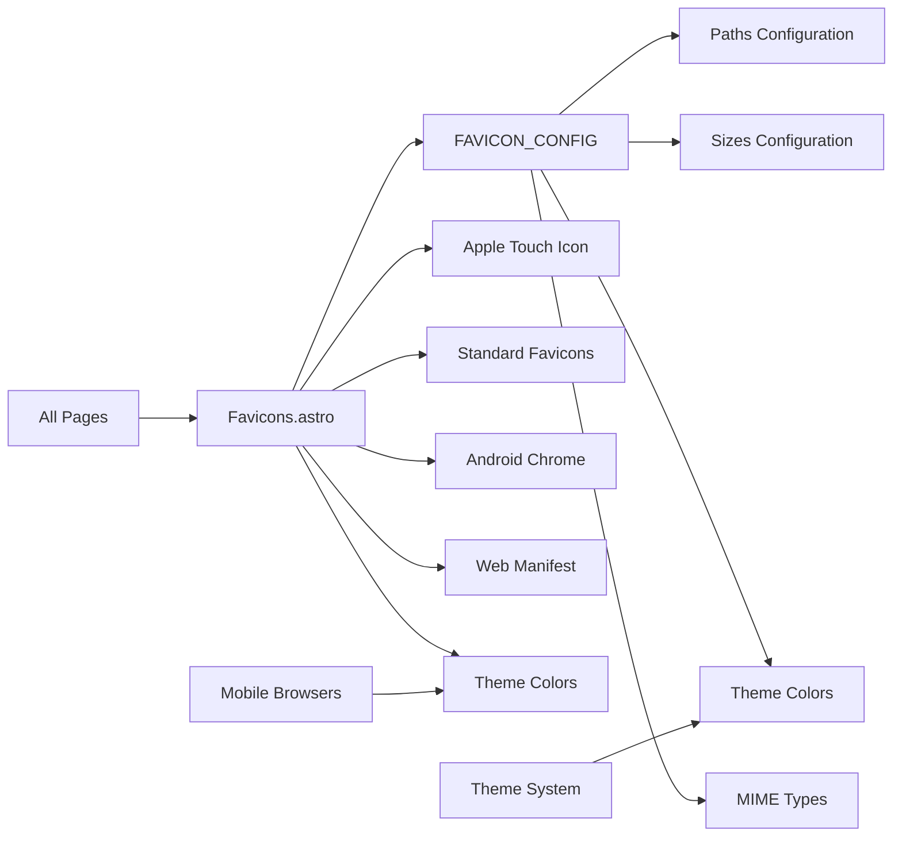

# Favicon System

## 🚀 **Resumen Ejecutivo**
Sistema centralizado de favicons con configuración unificada para todos los dispositivos y navegadores. Proporciona soporte completo para Apple Touch Icons, Android Chrome, navegadores de escritorio y colores de tema móviles con configuración centralizada.

**Arquitectura:** Configuration-Driven + Device-Specific + Theme Integration



## 🧠 **Core Logic**

### **1. Centralized Configuration**
```typescript
// FAVICON_CONFIG in src/config/site.ts
export const FAVICON_CONFIG = {
  // Theme colors for mobile browsers
  themeColor: {
    light: '#699CF9',
    dark: '#699CF9'
  },
  
  // Microsoft tile color
  msApplicationTileColor: '#699CF9',
  
  // Favicon paths configuration
  paths: {
    appleTouchIcon: '/apple-touch-icon.png',
    favicon32: '/favicon-32x32.png',
    favicon16: '/favicon-16x16.png',
    manifest: '/site.webmanifest',
    shortcutIcon: '/favicon.ico',
    androidChrome192: '/android-chrome-192x192.png',
    androidChrome512: '/android-chrome-512x512.png'
  },
  
  // Icon sizes configuration
  sizes: {
    appleTouchIcon: '180x180',
    favicon32: '32x32',
    favicon16: '16x16',
    androidChrome192: '192x192',
    androidChrome512: '512x512'
  },
  
  // MIME types
  mimeTypes: {
    png: 'image/png',
    ico: 'image/x-icon'
  }
} as const;
```

### **2. Unified Favicons Component**
```astro
---
// src/components/seo/Favicons.astro
import { FAVICON_CONFIG } from '../../config/site.ts';

interface Props {
  themeColor?: string;
  msApplicationTileColor?: string;
}

const { 
  themeColor = FAVICON_CONFIG.themeColor.light,
  msApplicationTileColor = FAVICON_CONFIG.msApplicationTileColor
} = Astro.props;

const config = FAVICON_CONFIG;
---

<!-- Apple Touch Icon -->
<link 
  rel="apple-touch-icon" 
  sizes={config.sizes.appleTouchIcon} 
  href={config.paths.appleTouchIcon}
>

<!-- Standard Favicons -->
<link 
  rel="icon" 
  type={config.mimeTypes.png} 
  sizes={config.sizes.favicon32} 
  href={config.paths.favicon32}
>

<!-- Theme Colors for Mobile Browsers -->
<meta name="theme-color" content={themeColor}>
<meta name="msapplication-TileColor" content={msApplicationTileColor}>
```

### **3. Device-Specific Support**
```astro
<!-- Apple Touch Icon (iOS Safari) -->
<link rel="apple-touch-icon" sizes="180x180" href="/apple-touch-icon.png">

<!-- Standard Favicons (Desktop Browsers) -->
<link rel="icon" type="image/png" sizes="32x32" href="/favicon-32x32.png">
<link rel="icon" type="image/png" sizes="16x16" href="/favicon-16x16.png">

<!-- Android Chrome Icons -->
<link rel="icon" type="image/png" sizes="192x192" href="/android-chrome-192x192.png">
<link rel="icon" type="image/png" sizes="512x512" href="/android-chrome-512x512.png">

<!-- Web App Manifest -->
<link rel="manifest" href="/site.webmanifest">

<!-- Shortcut Icon (ICO fallback) -->
<link rel="shortcut icon" href="/favicon.ico">
```

## 📌 **Usage**

### **Basic Usage (Default Theme Colors)**
```astro
---
import Favicons from '../components/seo/Favicons.astro';
---

<html>
<head>
  <Favicons />
</head>
</html>
```

### **Custom Theme Colors**
```astro
---
import Favicons from '../components/seo/Favicons.astro';
---

<html>
<head>
  <Favicons 
    themeColor="#FF5733" 
    msApplicationTileColor="#FF5733" 
  />
</head>
</html>
```

### **Dynamic Theme Colors (Dark/Light Mode)**
```astro
---
import Favicons from '../components/seo/Favicons.astro';
import { FAVICON_CONFIG } from '../config/site.ts';

// Get theme from somewhere (localStorage, props, etc.)
const isDarkMode = false; // Example
const themeColor = isDarkMode ? FAVICON_CONFIG.themeColor.dark : FAVICON_CONFIG.themeColor.light;
---

<html>
<head>
  <Favicons themeColor={themeColor} />
</head>
</html>
```

## ⚙️ **Configuración**

### **Favicon Configuration** (`src/config/site.ts`)
```typescript
export const FAVICON_CONFIG = {
  /** Theme colors for mobile browsers */
  themeColor: {
    light: '#699CF9',  // Light mode theme color
    dark: '#699CF9'    // Dark mode theme color (can be different)
  },
  
  /** Microsoft tile color for Windows */
  msApplicationTileColor: '#699CF9',
  
  /** Favicon file paths (relative to public/) */
  paths: {
    appleTouchIcon: '/apple-touch-icon.png',        // 180x180 PNG
    favicon32: '/favicon-32x32.png',                // 32x32 PNG
    favicon16: '/favicon-16x16.png',                // 16x16 PNG
    manifest: '/site.webmanifest',                  // Web app manifest
    shortcutIcon: '/favicon.ico',                   // ICO fallback
    androidChrome192: '/android-chrome-192x192.png', // 192x192 PNG
    androidChrome512: '/android-chrome-512x512.png'  // 512x512 PNG
  },
  
  /** Icon sizes for HTML attributes */
  sizes: {
    appleTouchIcon: '180x180',
    favicon32: '32x32',
    favicon16: '16x16',
    androidChrome192: '192x192',
    androidChrome512: '512x512'
  },
  
  /** MIME types for link elements */
  mimeTypes: {
    png: 'image/png',
    ico: 'image/x-icon'
  }
} as const;
```

### **Required Files in public/ Directory**
```
public/
├── apple-touch-icon.png          # 180x180 PNG for iOS
├── favicon-32x32.png             # 32x32 PNG for modern browsers
├── favicon-16x16.png             # 16x16 PNG for older browsers
├── favicon.ico                   # ICO fallback for legacy browsers
├── android-chrome-192x192.png    # 192x192 PNG for Android
├── android-chrome-512x512.png    # 512x512 PNG for Android
└── site.webmanifest              # Web app manifest
```

## 🛠️ **Extensión**

### **Adding New Icon Sizes**
1. Add new path to `FAVICON_CONFIG.paths`
2. Add corresponding size to `FAVICON_CONFIG.sizes`
3. Update Favicons.astro component to include new link element
4. Add physical file to public/ directory

### **Custom Theme Colors per Page**
```astro
---
// Different theme colors for different sections
const blogThemeColor = '#FF6B6B';
const portfolioThemeColor = '#4ECDC4';
---

<Favicons themeColor={blogThemeColor} />
```

### **Integration with Theme System**
```astro
---
import { FAVICON_CONFIG } from '../config/site.ts';

// Get current theme from theme manager
const currentTheme = 'dark'; // From theme system
const themeColor = FAVICON_CONFIG.themeColor[currentTheme];
---

<Favicons themeColor={themeColor} />
```

## 🔒 **Features & Capabilities**

### **Device Support**
- ✅ **iOS Safari** - Apple Touch Icon (180x180)
- ✅ **Android Chrome** - Multiple sizes (192x192, 512x512)
- ✅ **Desktop Browsers** - Standard favicons (32x32, 16x16)
- ✅ **Legacy Browsers** - ICO fallback
- ✅ **Windows Tiles** - Microsoft application tile color
- ✅ **PWA Support** - Web app manifest integration

### **Theme Integration**
- ✅ **Mobile Theme Colors** - Dynamic theme-color meta tag
- ✅ **Light/Dark Mode** - Configurable colors for both themes
- ✅ **Custom Colors** - Per-page theme color override
- ✅ **Microsoft Tiles** - Windows-specific tile colors

### **Configuration-Driven**
- ✅ **Centralized Paths** - All favicon paths in one place
- ✅ **Size Management** - Consistent size attributes
- ✅ **MIME Type Safety** - Proper content types
- ✅ **Easy Maintenance** - Single source of truth

## 🤖 **AI Context Block**

```yaml
feature_type: "favicon_system"
input_sources: ["favicon_config", "theme_colors", "device_requirements"]
output_formats: ["html_link_tags", "meta_tags", "manifest_links"]
validation_method: "device_testing"
error_patterns: ["missing_favicon_files", "incorrect_sizes", "invalid_mime_types"]
dependencies: ["theme_system", "site_config"]
performance_impact: "minimal_overhead"
browser_support: ["ios_safari", "android_chrome", "desktop_browsers", "legacy_ie"]
device_coverage: "universal"
architecture_pattern: "configuration_driven_component"
theme_integration: "dynamic_colors"
file_requirements: ["public_directory_icons"]
```

## ❓ **FAQ**

**Q: ¿Qué archivos de favicon necesito en public/?**  
A: Necesitas 7 archivos: apple-touch-icon.png (180x180), favicon-32x32.png, favicon-16x16.png, favicon.ico, android-chrome-192x192.png, android-chrome-512x512.png, y site.webmanifest.

**Q: ¿Cómo cambio los colores de tema?**  
A: Modifica `FAVICON_CONFIG.themeColor` en site.ts o pasa props personalizadas al componente Favicons.

**Q: ¿Funciona con el sistema de temas dark/light?**  
A: Sí. Puedes configurar colores diferentes para light y dark mode en `themeColor.light` y `themeColor.dark`.

**Q: ¿Qué pasa si faltan archivos de favicon?**  
A: Los navegadores mostrarán errores 404, pero el sitio seguirá funcionando. Es recomendable tener todos los archivos.

**Q: ¿Puedo usar diferentes favicons por página?**  
A: Sí. Cambia las props `themeColor` o modifica las rutas en FAVICON_CONFIG para diferentes secciones.

---

**Archivos Clave:**
- `src/components/seo/Favicons.astro` - Componente principal de favicons
- `src/config/site.ts` - Configuración centralizada (FAVICON_CONFIG)
- `public/` - Directorio con archivos físicos de favicons

**Status:** ✅ Production Ready  
**Device Coverage:** Universal (iOS, Android, Desktop, Legacy)  
**Theme Integration:** ✅ Dynamic colors + Light/Dark mode support  
**Configuration:** ✅ Centralized + Extensible  
**Performance:** ✅ Minimal overhead + Proper caching headers
