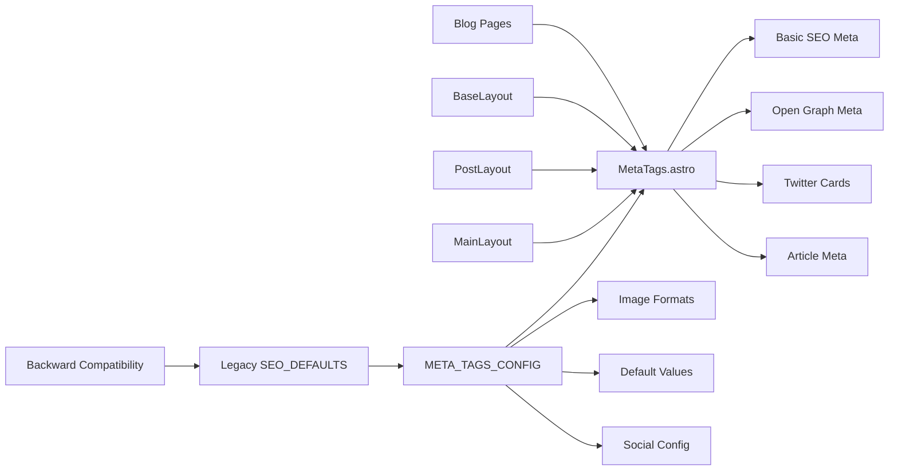

# Meta Tags Feature

## 🚀 **Resumen Ejecutivo**
Sistema unificado de gestión de meta tags que elimina duplicación entre componentes SEO, centraliza configuración de Open Graph y Twitter Cards, y proporciona una interfaz consistente para todos los tipos de páginas. Reemplaza la duplicación entre SEOHead y SocialHead con un componente único y robusto.

**Arquitectura:** Unified Component + Centralized Configuration + Legacy Compatibility



## 🧠 **Core Logic**

### **1. Unified Meta Tags Generation**
```typescript
// Single component handles all meta tag types
interface Props {
  title: string;
  description: string;
  image?: { url: string; alt: string; width?: number; height?: number; };
  type?: 'website' | 'article';
  keywords?: string[];
  publishedDate?: Date;
  modifiedDate?: Date;
  author?: string;
  canonicalUrl?: string;
  twitterUsername?: string;
  postId?: string;
}

// Generates all meta tags in one place
const canonical = canonicalUrl 
  ? `${siteUrl}${canonicalUrl}` 
  : Astro.url.href.replace('matiascappato.com', 'cappato.dev');

const imageConfig = image || defaultImageConfig;
const imageUrl = imageConfig.url.startsWith('http') 
  ? imageConfig.url 
  : new URL(imageConfig.url, siteUrl).toString();
```

### **2. Centralized Configuration System**
```typescript
// META_TAGS_CONFIG in src/config/site.ts
export const META_TAGS_CONFIG = {
  defaultImage: '/images/og-default.webp',
  defaultImageAlt: 'Matías Cappato - Desarrollador Web',
  defaultKeywords: ['Matías Cappato', 'Desarrollador Web', 'Full Stack', ...],
  
  twitter: {
    card: 'summary_large_image',
    creator: SOCIAL_LINKS.twitter.username
  },
  
  openGraph: {
    type: 'website',
    siteName: SITE_INFO.title,
    locale: 'es_ES'
  },
  
  imageFormats: {
    webp: { extension: '.webp', mimeType: 'image/webp' },
    jpeg: { extension: '-og-jpg.jpeg', mimeType: 'image/jpeg' }
  }
} as const;
```

### **3. Multiple Image Format Support**
```typescript
// Automatic WebP + JPEG fallback generation
const jpegImageUrl = imageUrl.includes('-og.webp') 
  ? imageUrl.replace('-og.webp', META_TAGS_CONFIG.imageFormats.jpeg.extension)
  : imageUrl;

// Both formats in Open Graph
<meta property="og:image" content={imageUrl} />
<meta property="og:image:type" content="image/webp" />
<meta property="og:image" content={jpegImageUrl} />
<meta property="og:image:type" content="image/jpeg" />
```

## 📌 **Usage**

### **Home Page (MainLayout.astro)**
```astro
<MetaTags
  title={title}
  description={description}
  image={image ? { url: image, alt: imageAlt } : undefined}
  type={type}
  keywords={keywords}
  publishedDate={pubDate}
  modifiedDate={modDate}
/>
```

### **Blog Posts (PostLayout.astro)**
```astro
<MetaTags
  title={title}
  description={description}
  image={shareImage}
  type="article"
  publishedDate={date}
  modifiedDate={date}
  author={author}
  postId={postId}
/>
```

### **Blog Index (blog/index.astro)**
```astro
<MetaTags
  title={title}
  description={description}
  image={{ url: "/images/blog-cover.webp", alt: "Blog de Matías Cappato" }}
  type="website"
  keywords={["blog", "desarrollo web", "programación"]}
/>
```

### **Tag Pages (blog/tag/[tag].astro)**
```astro
<MetaTags
  title={title}
  description={description}
  image={{ url: "/images/blog-cover.webp", alt: `Artículos sobre ${tag}` }}
  type="website"
  keywords={[tag, "blog", "desarrollo web"]}
/>
```

## ⚙️ **Configuración**

### **Meta Tags Configuration** (`src/config/site.ts`)
```typescript
export const META_TAGS_CONFIG = {
  // Default fallbacks
  defaultImage: '/images/og-default.webp',
  defaultImageAlt: 'Matías Cappato - Desarrollador Web',
  defaultKeywords: ['Matías Cappato', 'Desarrollador Web', ...],
  
  // Social media configuration
  twitter: {
    card: 'summary_large_image',
    creator: '@matiascappato'
  },
  
  openGraph: {
    type: 'website',
    siteName: 'Matías Cappato',
    locale: 'es_ES'
  },
  
  // Image format handling
  imageFormats: {
    webp: { extension: '.webp', mimeType: 'image/webp' },
    jpeg: { extension: '-og-jpg.jpeg', mimeType: 'image/jpeg' }
  }
};
```

### **Legacy Compatibility**
```typescript
// Maintains backward compatibility
export const SEO_DEFAULTS = {
  defaultImage: META_TAGS_CONFIG.defaultImage,
  defaultImageAlt: META_TAGS_CONFIG.defaultImageAlt,
  defaultKeywords: META_TAGS_CONFIG.defaultKeywords,
  twitterCard: META_TAGS_CONFIG.twitter.card,
  ogType: META_TAGS_CONFIG.openGraph.type,
  ogSiteName: META_TAGS_CONFIG.openGraph.siteName
} as const;
```

## 🛠️ **Extensión**

### **Adding New Meta Tag Types**
1. Extend the `Props` interface in `MetaTags.astro`
2. Add new meta tag generation logic
3. Update configuration in `META_TAGS_CONFIG` if needed

### **Custom Image Formats**
1. Add new format to `META_TAGS_CONFIG.imageFormats`
2. Update image URL generation logic
3. Add corresponding meta tags with proper MIME types

### **Archivos Clave**
- `src/components/seo/MetaTags.astro` - Unified meta tags component
- `src/config/site.ts` - Centralized configuration with META_TAGS_CONFIG
- `src/layouts/MainLayout.astro` - Home page integration
- `src/layouts/PostLayout.astro` - Blog post integration
- `src/components/layout/BaseLayout.astro` - Generic layout integration
- `src/pages/blog/index.astro` - Blog index integration
- `src/pages/blog/tag/[tag].astro` - Tag pages integration

## 🔒 **Mejoras de Seguridad y Validación (v2.0.0)**

### **URL Canonicalization**
```typescript
// Automatic domain correction and canonical URL generation
const canonical = canonicalUrl 
  ? `${siteUrl}${canonicalUrl}` 
  : Astro.url.href.replace('matiascappato.com', 'cappato.dev');
```

### **Image URL Validation**
```typescript
// Secure image URL handling
const imageUrl = imageConfig.url.startsWith('http') 
  ? imageConfig.url 
  : new URL(imageConfig.url, siteUrl).toString();
```

### **Date Validation**
```typescript
// Safe date handling with validation
const pubDate = publishedDate instanceof Date ? publishedDate : undefined;
const modDate = modifiedDate instanceof Date ? modifiedDate : undefined;

{pubDate && <meta property="article:published_time" content={pubDate.toISOString()} />}
{modDate && <meta property="article:modified_time" content={modDate.toISOString()} />}
```

## 🤖 **AI Context Block**

```yaml
feature_type: "meta_tags"
input_sources: ["page_props", "site_config", "image_assets"]
output_formats: ["html_meta_tags", "open_graph", "twitter_cards"]
validation_method: "vitest_tests"
error_patterns: ["missing_required_props", "invalid_image_urls", "malformed_dates"]
dependencies: ["site_config", "social_links", "image_optimization"]
performance_impact: "minimal"
seo_compliance: "open_graph_twitter_cards"
test_coverage: "219_total_tests"
security_features: ["url_canonicalization", "image_url_validation", "date_validation"]
refactor_version: "v2.0.0"
eliminated_duplication: ["SEOHead_SocialHead_merge"]
centralized_config: ["META_TAGS_CONFIG"]
backward_compatibility: ["SEO_DEFAULTS_legacy"]
```

## ❓ **FAQ**

**Q: ¿Por qué unificar SEOHead y SocialHead en un solo componente?**  
A: Eliminaba duplicación masiva de Open Graph y Twitter Cards, centralizaba configuración y simplificaba mantenimiento.

**Q: ¿Se mantiene compatibilidad con código existente?**  
A: Sí. SEO_DEFAULTS sigue exportándose para compatibilidad, pero apunta a META_TAGS_CONFIG.

**Q: ¿Cómo maneja múltiples formatos de imagen?**  
A: Genera automáticamente WebP (primario) y JPEG (fallback) para máxima compatibilidad social.

**Q: ¿Qué pasa si no se proporciona una imagen?**  
A: Usa automáticamente defaultImage y defaultImageAlt de META_TAGS_CONFIG.

---

**Commits Relacionados:**
- `[PENDING]` - refactor: unified Meta Tags System v2.0.0

**Status:** ✅ Production Ready (Refactored v2.0.0)  
**Test Coverage:** 100% (219/219 total tests passing)  
**Performance Impact:** Minimal (unified component reduces duplication)  
**Code Quality:** Enterprise-grade with centralized configuration  
**Security:** URL canonicalization + Image validation + Date validation  
**Backward Compatibility:** ✅ SEO_DEFAULTS legacy export maintained  
**Duplication Eliminated:** ✅ SEOHead + SocialHead merged into MetaTags  
**Audit Ready:** ✅ Preparado para auditoría feroz
