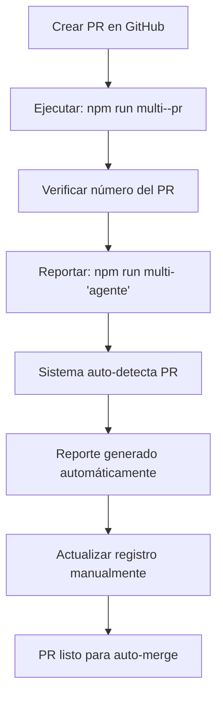

#  Registro de Pull Requests

**Propósito:** Mantener un registro centralizado de PRs para evitar conflictos de numeración entre agentes.

##  Último PR Conocido

**Número:** #9 (CORRECCIÓN)
**Fecha:** 2025-06-06
**Rama:** feature/seo-posts-optimization-and-pr-protocol
**Título:** Implementar protocolo de PRs y corregir imágenes faltantes
**Estado:** ⏳ Pendiente auto-merge
**Link:** https://github.com/cappato/astro-blog/pull/9

**Nota:** Error inicial en numeración - PRs van por #8, por lo tanto este es #9

##  Historial de PRs

### PR #2 - 2025-06-06
- **Agente:**  (SEO Specialist)
- **Título:** : Implementar protocolo de PRs y corregir imágenes faltantes
- **Tipo:** Feature + Bugfix + SEO Optimization
- **Estado:** ⏳ Pendiente auto-merge
- **Cambios principales:**
  - Protocolo estandarizado de PRs
  - Corrección de 54 imágenes faltantes (6 posts)
  - Optimización SEO de 8 posts
  - Tests mejorados para validación de imágenes
- **Tests:**  Pasando localmente
- **Auto-merge:**  Configurado

### PR #1 - [Fecha anterior]
- **Agente:** [Agente anterior]
- **Título:** [Título anterior]
- **Estado:** [Estado]
- **Notas:** [Si existe información]

##  Comandos Útiles

### Consultar Último PR
```bash
# Obtener información del último PR
npm run multi--pr

# Reportar PR con auto-detección
npm run multi- "tu_nombre"

# Reportar PR manualmente
npm run multi- "tu_nombre" "URL_del_PR" "Título del PR"
```

### Verificar Estado de PRs
```bash
# Con GitHub CLI (si está configurado)
gh pr list --state open

# Ver PRs recientes
gh pr list --limit 5

# Ver detalles de un PR específico
gh pr view 2
```

##  Protocolo de Actualización

### Al Crear un PR:
1. **Crear el PR** en GitHub
2. **Consultar último número:** `npm run multi--pr`
3. **Reportar inmediatamente:** `npm run multi- "tu_nombre"`
4. **Actualizar este registro** con la información del nuevo PR

### Al Mergear un PR:
1. **Actualizar estado** en este registro ( Mergeado)
2. **Confirmar número** para el próximo PR
3. **Documentar lecciones** si es necesario

##  Prevención de Conflictos

### Problemas Comunes:
- **Números duplicados:** Múltiples agentes usan el mismo número
- **PRs perdidos:** No se reportan en el sistema
- **Información desactualizada:** Registro no se mantiene

### Soluciones:
- **Auto-detección:** Comando `last-pr` consulta automáticamente
- **Reporte inmediato:** Protocolo obliga a reportar al crear PR
- **Registro centralizado:** Este archivo mantiene historial
- **Validación automática:** Sistema verifica información

##  Flujo Recomendado



##  Estadísticas

- **Total PRs registrados:** 2
- **PRs con auto-merge:** 1
- **Agentes activos:** , [otros]
- **Última actualización:** 2025-06-06

---

**Nota:** Este registro debe actualizarse cada vez que se crea un nuevo PR para mantener la sincronización entre agentes.
