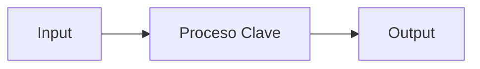

# Prompt para Documentación de Features

**Objetivo:** Generar documentación técnica completa pero concisa para una feature existente, siguiendo estándares probados y optimizada para contexto de IA.

**Extensión:** Ideal 100-150 líneas | Máximo 300 líneas (solo para features muy complejas)

```markdown
# INSTRUCCIONES PARA LA IA

## 🛠️ **Contexto Inicial**  
Estoy documentando la feature `[NOMBRE_FEATURE]` en nuestro proyecto `[NOMBRE_PROYECTO]`.  
**Tech Stack:** [Astro/React/Etc.], [TypeScript/JavaScript], [Otras librerías clave].  

## 📜 **Estructura Requerida**  
Genera un documento Markdown con ESTAS SECCIONES:  

### 1. 🚀 **Resumen Ejecutivo** (3-5 líneas)  
- Problema que resuelve  
- Solución en una frase  
- Arquitectura general (ej: "Auto-detection + transformación")  



### 2. 🧠 **Core Logic**
- Algoritmo/Flujo principal (3 pasos máximo)
- Snippet de código MÁS IMPORTANTE (5-10 líneas)

### 3. 📌 **Usage**
- Ejemplo mínimo de implementación
- Configuración obligatoria (si aplica)

### 4. ⚙️ **Configuración**
- Archivo principal de configuración
- Variables/valores REQUERIDOS

### 5. 🛠️ **Extensión**
- Pasos para agregar funcionalidad nueva
- Archivos clave a modificar

### 6. 🤖 **AI Context Block** (YAML)
```yaml
feature_type: ""  
input_sources: []  
output_format: ""  
validation_method: ""  
error_patterns: []  
```

### 7. ❓ **FAQ** (2-3 preguntas comunes)
- Pregunta + respuesta corta

## ✨ **Reglas de Extensión**
- **Ideal:** 100-150 líneas (equilibrio óptimo entre completitud y concisión)
- **Máximo:** 300 líneas (solo para features muy complejas o críticas)
- **Lenguaje:** Técnico pero accesible
- **Priorizar información para:**
  - Nuevos desarrolladores
  - IAs que necesitan contexto
  - Mantenimiento futuro
- **Obligatorio:** Diagrama mermaid + ejemplos concretos
- **Preferir:** Ejemplos de código sobre explicaciones abstractas

## 🔍 **Datos para Analizar**
[Pega aquí código relevante o describe la feature]
```

---

## 🎯 **Cómo usarlo:**  
1. Reemplaza los valores entre `[]`  
2. Agrega código/descripción de la feature  
3. Ejecuta con tu IA preferida  

## 📌 **Ejemplo Real** (Para feature "Auth"):  
```markdown
# INSTRUCCIONES PARA LA IA  

## 🛠️ Contexto Inicial  
Feature: `auth-module`  
Proyecto: `Next.js E-commerce`  
Tech Stack: Next.js, TypeScript, NextAuth.js  

## 🔍 Datos para Analizar  
```typescript
// pages/api/auth/[...nextauth].ts
export default NextAuth({
  providers: [GoogleProvider({ clientId: process.env.GOOGLE_ID })],
  callbacks: {
    async jwt({ token }) { /* ... */ }
  }
})
```

La IA generará un documento como el de schema.org pero para autenticación, en el mismo formato compacto.

## ✅ **Beneficios Clave**
- **Estandarización:** Todas las features documentadas igual
- **IA-Friendly:** Estructura predecible para parsing
- **Mantenible:** Actualizable en minutos
