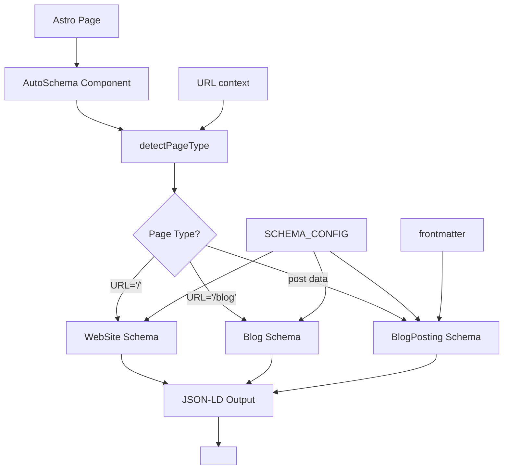

# Schema.org Auto-Generation Feature

## 1. Core Purpose
Automated Schema.org structured data generation for Astro projects that eliminates manual maintenance through intelligent auto-detection and frontmatter extraction.

## 2. Architecture DNA



**Key Components:**
- `AutoSchema.astro`: Main component with auto-detection
- `engine.ts`: Schema generation logic
- `config.ts`: Centralized configuration
- `validate-schemas.js`: Production validation

## 3. Test-First Specs

```typescript
// Test 1: Auto-detection behavior
describe('detectPageType', () => {
  it('should prioritize explicit data over URL patterns', () => {
    const context = { url: '/blog/post', post: mockPost };
    expect(detectPageType(context)).toBe('blog-post'); // post data wins
  });
});

// Test 2: Schema generation
describe('generateSchema', () => {
  it('should extract all frontmatter fields automatically', () => {
    const post = { data: { title: 'Test', date: '2025-01-15', author: 'John' } };
    const schema = generateBlogPostSchema(post, 'https://site.com/blog/test');
    expect(schema.headline).toBe('Test');
    expect(schema.datePublished).toBe('2025-01-15T00:00:00.000Z');
  });
});

// Test 3: Error handling
describe('AutoSchema component', () => {
  it('should fail gracefully without breaking page', () => {
    const invalidContext = { url: null, post: null };
    expect(() => generateSchema(invalidContext)).not.toThrow();
  });
});
```

## 4. Key Components

| File | Responsibility | Key Exports |
|------|----------------|-------------|
| `AutoSchema.astro` | Main component, error handling | `<AutoSchema />` |
| `engine.ts` | Schema generation logic | `generateSchema()`, `detectPageType()` |
| `config.ts` | Site configuration | `SCHEMA_CONFIG`, `PageType` |
| `index.ts` | Public API | All exports for external use |
| `validate-schemas.js` | Production validation | CLI validation scripts |

## 5. Usage Examples

### Input → Output
```markdown
<!-- Input: Blog post frontmatter -->
---
title: "Optimizando SEO con Astro"
description: "Guía completa para mejorar el SEO de tu sitio Astro"
date: 2025-01-15
author: "Matías Cappato"
image: "/images/seo-astro.webp"
tags: ["astro", "seo", "performance"]
---

<!-- Component usage -->
<AutoSchema post={entry} />
```

```json
// Output: Generated JSON-LD
{
  "@context": "https://schema.org",
  "@type": "BlogPosting",
  "headline": "Optimizando SEO con Astro",
  "description": "Guía completa para mejorar el SEO de tu sitio Astro",
  "datePublished": "2025-01-15T00:00:00.000Z",
  "author": { "@type": "Person", "name": "Matías Cappato" },
  "image": "https://cappato.dev/images/seo-astro.webp",
  "keywords": "astro, seo, performance",
  "wordCount": 1250,
  "url": "https://cappato.dev/blog/optimizando-seo-con-astro"
}
```

### Auto-detection
```astro
<!-- URL: https://site.com/ -->
<AutoSchema /> → WebSite schema

<!-- URL: https://site.com/blog -->
<AutoSchema /> → Blog schema

<!-- URL: https://site.com/blog/post + post data -->
<AutoSchema post={entry} /> → BlogPosting schema
```

## 6. Error Playbook

| Error | Cause | Fallback | Prevention |
|-------|-------|----------|------------|
| Missing frontmatter | Post without required fields | Default values from config | Validate in tests |
| Invalid date | Malformed date string | Current date | Schema validation |
| Relative URLs | Image paths without domain | Convert to absolute | `toAbsoluteUrl()` |
| Generation failure | Runtime error | Empty schemas array | Try-catch wrapper |

**Graceful Degradation:**
```typescript
try {
  schemas = generateSchema(context);
} catch (error) {
  console.error('AutoSchema: Error generating schemas:', error);
  schemas = []; // Page continues to work
}
```

## 7. AI Context Block

```yaml
feature:
  name: "schema-org-auto-generation"
  type: "seo-automation"
  status: "production"
  
architecture:
  pattern: "auto-detection"
  input_source: "frontmatter + url"
  output_format: "json-ld"
  error_strategy: "graceful_degradation"
  
dependencies:
  astro: "content_collections"
  typescript: "strict_mode"
  testing: "vitest"
  
extension_points:
  - config.ts: "site_configuration"
  - engine.ts: "schema_generation_logic"
  - PageType: "supported_page_types"
  - validation: "custom_rules"
  
usage_patterns:
  content_creation: "automatic_from_frontmatter"
  site_expansion: "auto_discovery"
  cross_project: "copy_feature_folder"
  quality_assurance: "integrated_validation"
  
success_metrics:
  maintenance: "zero_manual"
  scalability: "unlimited_automatic"
  reusability: "cross_project"
  reliability: "error_prevention"
```
