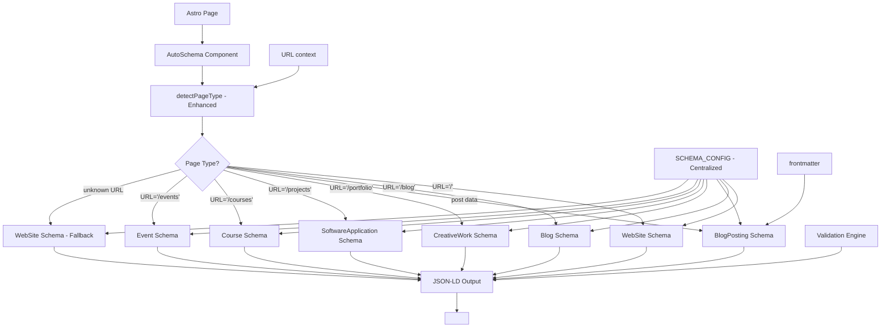

# Schema.org Auto-Generation Feature - Enhanced

## 1. Core Purpose
Enhanced automated Schema.org structured data generation for Astro projects with intelligent auto-detection, expanded content types (12+), validation, and centralized configuration. Eliminates manual maintenance and duplicate systems through unified architecture.

## 2. Architecture DNA



**Key Components:**
- `AutoSchema.astro`: Main unified component with enhanced auto-detection
- `engine.ts`: Enhanced schema generation logic with 12+ content types
- `config.ts`: Centralized configuration (uses SCHEMA_CONFIG from site.ts)
- `site.ts`: SCHEMA_CONFIG centralized configuration
- `validate-schemas.js`: Production validation with automatic field checking

**Enhanced Features:**
- ✅ **12+ Content Types**: WebSite, Blog, BlogPosting, CreativeWork, SoftwareApplication, Course, Event, Product, Organization, Person, Article
- ✅ **Intelligent Auto-Detection**: Pattern matching with priority system
- ✅ **Automatic Validation**: Required field checking with graceful fallbacks
- ✅ **Centralized Configuration**: Single source of truth in SCHEMA_CONFIG
- ✅ **Duplicate Elimination**: Unified system replacing multiple implementations
- ✅ **Error Handling**: Graceful degradation with development warnings

## 3. Test-First Specs

```typescript
// Test 1: Auto-detection behavior
describe('detectPageType', () => {
  it('should prioritize explicit data over URL patterns', () => {
    const context = { url: '/blog/post', post: mockPost };
    expect(detectPageType(context)).toBe('blog-post'); // post data wins
  });
});

// Test 2: Schema generation
describe('generateSchema', () => {
  it('should extract all frontmatter fields automatically', () => {
    const post = { data: { title: 'Test', date: '2025-01-15', author: 'John' } };
    const schema = generateBlogPostSchema(post, 'https://site.com/blog/test');
    expect(schema.headline).toBe('Test');
    expect(schema.datePublished).toBe('2025-01-15T00:00:00.000Z');
  });
});

// Test 3: Enhanced auto-detection
describe('Enhanced detectPageType', () => {
  it('should fallback to website for unknown URLs', () => {
    const context = { url: 'https://cappato.dev/noticias/' };
    expect(detectPageType(context)).toBe('website'); // Safe fallback
  });

  it('should detect home page correctly', () => {
    const context = { url: 'https://cappato.dev/' };
    expect(detectPageType(context)).toBe('home'); // Specific home detection
  });
});

// Test 4: Validation system
describe('Schema validation', () => {
  it('should validate required fields automatically', () => {
    const schema = { "@type": "BlogPosting", "headline": "Test" };
    const isValid = validateSchema(schema, "BlogPosting");
    expect(isValid).toBe(false); // Missing required fields
  });
});

// Test 5: Error handling
describe('AutoSchema component', () => {
  it('should fail gracefully without breaking page', () => {
    const invalidContext = { url: null, post: null };
    expect(() => generateSchema(invalidContext)).not.toThrow();
  });
});
```

## 4. Key Components

| File | Responsibility | Key Exports |
|------|----------------|-------------|
| `AutoSchema.astro` | Main unified component, enhanced auto-detection | `<AutoSchema />` |
| `engine.ts` | Enhanced schema generation (12+ types) | `generateSchema()`, `detectPageType()`, `validateSchema()` |
| `config.ts` | Feature configuration (uses centralized config) | `SCHEMA_CONFIG`, `PageType`, `SCHEMA_MAPPINGS` |
| `site.ts` | Centralized SCHEMA_CONFIG | `SCHEMA_CONFIG` (centralized) |
| `index.ts` | Public API with all enhanced exports | All exports + new schema generators |
| `validate-schemas.js` | Production validation with field checking | CLI validation scripts |

**Enhanced Exports:**
- `generateValidatedSchema()` - Schema generation with validation
- `getPortfolioSchema()`, `getProjectSchema()`, `getCourseSchema()` - New content type generators
- `getEventSchema()`, `getProductSchema()`, `getArticleSchema()` - Additional generators
- `validateSchema()` - Automatic field validation

## 5. Usage Examples

### Input → Output
```markdown
<!-- Input: Blog post frontmatter -->
---
title: "Optimizando SEO con Astro"
description: "Guía completa para mejorar el SEO de tu sitio Astro"
date: 2025-01-15
author: "Matías Cappato"
image: "/images/seo-astro.webp"
tags: ["astro", "seo", "performance"]
---

<!-- Component usage -->
<AutoSchema post={entry} />
```

```json
// Output: Generated JSON-LD
{
  "@context": "https://schema.org",
  "@type": "BlogPosting",
  "headline": "Optimizando SEO con Astro",
  "description": "Guía completa para mejorar el SEO de tu sitio Astro",
  "datePublished": "2025-01-15T00:00:00.000Z",
  "author": { "@type": "Person", "name": "Matías Cappato" },
  "image": "https://cappato.dev/images/seo-astro.webp",
  "keywords": "astro, seo, performance",
  "wordCount": 1250,
  "url": "https://cappato.dev/blog/optimizando-seo-con-astro"
}
```

### Enhanced Auto-detection
```astro
<!-- URL: https://site.com/ -->
<AutoSchema /> → WebSite schema

<!-- URL: https://site.com/blog -->
<AutoSchema /> → Blog schema

<!-- URL: https://site.com/blog/post + post data -->
<AutoSchema post={entry} /> → BlogPosting schema

<!-- URL: https://site.com/portfolio/ -->
<AutoSchema /> → CreativeWork schema

<!-- URL: https://site.com/projects/ -->
<AutoSchema /> → SoftwareApplication schema

<!-- URL: https://site.com/courses/ -->
<AutoSchema /> → Course schema

<!-- URL: https://site.com/events/ -->
<AutoSchema /> → Event schema

<!-- URL: https://site.com/noticias/ (unknown) -->
<AutoSchema /> → WebSite schema (safe fallback)

<!-- Explicit type override -->
<AutoSchema type="portfolio" /> → CreativeWork schema
<AutoSchema type="product" /> → Product schema
```

## 6. Error Playbook

| Error | Cause | Fallback | Prevention |
|-------|-------|----------|------------|
| Missing frontmatter | Post without required fields | Default values from config | Validate in tests |
| Invalid date | Malformed date string | Current date | Schema validation |
| Relative URLs | Image paths without domain | Convert to absolute | `toAbsoluteUrl()` |
| Generation failure | Runtime error | Empty schemas array | Try-catch wrapper |

**Graceful Degradation:**
```typescript
try {
  schemas = generateSchema(context);
} catch (error) {
  console.error('AutoSchema: Error generating schemas:', error);
  schemas = []; // Page continues to work
}
```

## 7. AI Context Block

```yaml
feature:
  name: "schema-org-auto-generation-enhanced"
  type: "seo-automation-unified"
  status: "production"
  version: "2.0.0"

architecture:
  pattern: "unified-auto-detection-with-validation"
  input_source: "frontmatter + url + context"
  output_format: "json-ld"
  error_strategy: "graceful_degradation_with_warnings"
  content_types: "12_plus_supported"

dependencies:
  astro: "content_collections"
  typescript: "strict_mode"
  testing: "vitest"
  configuration: "centralized_schema_config"

enhanced_features:
  content_types: ["WebSite", "Blog", "BlogPosting", "CreativeWork", "SoftwareApplication", "Course", "Event", "Product", "Organization", "Person", "Article"]
  auto_detection: "intelligent_pattern_matching"
  validation: "automatic_field_checking"
  configuration: "centralized_in_site_config"
  duplicate_elimination: "unified_single_system"

extension_points:
  - site.ts: "centralized_schema_configuration"
  - engine.ts: "enhanced_schema_generation_logic"
  - PageType: "expanded_supported_page_types"
  - validation: "automatic_required_field_rules"
  - patterns: "configurable_url_detection_patterns"

usage_patterns:
  content_creation: "automatic_from_frontmatter"
  site_expansion: "intelligent_auto_discovery"
  cross_project: "copy_feature_folder"
  quality_assurance: "integrated_validation_with_fallbacks"
  unknown_urls: "safe_website_schema_fallback"

success_metrics:
  maintenance: "zero_manual_unified_system"
  scalability: "unlimited_automatic_12_plus_types"
  reusability: "cross_project_enhanced"
  reliability: "error_prevention_with_validation"
  duplicate_elimination: "single_source_of_truth"
  industry_compliance: "yoast_rankmath_equivalent_plus"
```
