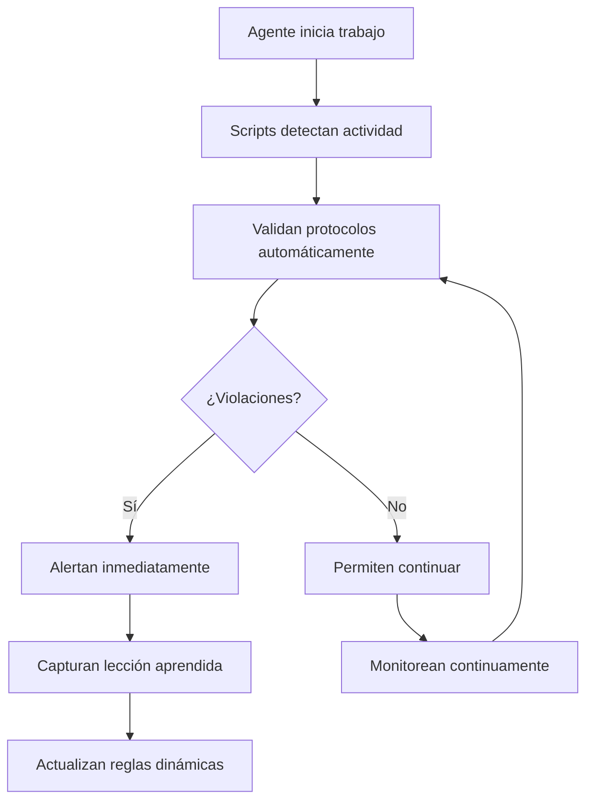

En el [post anterior](/blog/protocolos-automaticos-ia-arquitectura) vimos el problema y la visión. Ahora vamos a la implementación técnica completa del sistema que hace que funcione.

##  Lo que vas a lograr

Al final de esta guía tendrás:

-  **Sistema multi-agente funcionando** con coordinación automática
-  **Scripts de automatización** que aplican protocolos sin fallas
-  **Validación continua** de compliance en tiempo real
-  **Captura automática** de lecciones aprendidas

##  Prerrequisitos

Antes de empezar necesitas:

- Proyecto Node.js con TypeScript configurado
- Conocimiento básico de sistemas de archivos y git
- Entender el [problema original](/blog/protocolos-automaticos-ia-arquitectura)

## ️ Arquitectura del Sistema

### **Componentes Principales**

```
docs/multi-developer/
├── developer-assignments.md         # Responsabilidades por agente
├── work-status.md              # Estado en tiempo real
├── conflict-log.md             # Conflictos + lecciones aprendidas
├── protocols/                  # Protocolos específicos
│   ├── shared-protocols.md     # Reglas compartidas
│   ├── frontend-protocols.md   # Específicos frontend
│   └── content-protocols.md    # Específicos content
└── templates/                  # Plantillas estándar
    ├── task-assignment.md
    ├── status-update.md
    └── conflict-resolution.md

scripts/
└── multi-developer-manager.js     # Motor de automatización
```

### **Flujo de Automatización**



##  Implementación del Motor Principal

### **multi-developer-manager.js: El Cerebro del Sistema**

```javascript
class MultiAgentManager {
  async checkProtocolCompliance() {
    console.log(' Checking protocol compliance...');

    const activeAgents = this.parseActiveAgents();
    const violations = [];

    for (const developer of activeAgents) {
      // APLICA REGLA: TypeScript Obligatorio
      const jsFiles = developer.files.filter(file =>
        file.endsWith('.js') && !file.includes('config')
      );
      if (jsFiles.length > 0) {
        violations.push(
          `developer ${developer.name}: Using JavaScript instead of TypeScript: ${jsFiles.join(', ')}`
        );
      }

      // APLICA REGLA: Status Updates Reales
      if (developer.lastUpdate === '[YYYY-MM-DD HH:MM]') {
        violations.push(
          `developer ${developer.name}: Status not updated with real timestamp`
        );
      }

      // APLICA REGLA: File Ownership
      const unauthorizedFiles = this.checkFileOwnership(developer);
      if (unauthorizedFiles.length > 0) {
        violations.push(
          `developer ${developer.name}: Working on unauthorized files: ${unauthorizedFiles.join(', ')}`
        );
      }
    }

    // ALERTA INMEDIATA si hay violaciones
    if (violations.length > 0) {
      console.log('️ Protocol violations detected:');
      violations.forEach(violation => console.log(`   - ${violation}`));
    }

    return violations;
  }
}
```

### **Sistema de Lecciones Aprendidas Automático**

```javascript
async captureLesson(lessonData) {
  console.log('🧠 Capturing new lesson learned...');

  const conflictLogPath = `${DOCS_DIR}/conflict-log.md`;
  let conflictLog = await fs.readFile(conflictLogPath, 'utf8');

  // Crear entrada de lección
  const lessonEntry = this.formatLessonEntry(lessonData, timestamp);

  // Insertar automáticamente en Dynamic Learning System
  const insertionPoint = conflictLog.indexOf('### Rule Application Protocol');
  conflictLog = conflictLog.slice(0, insertionPoint) +
                lessonEntry + '\n' +
                conflictLog.slice(insertionPoint);

  await fs.writeFile(conflictLogPath, conflictLog);
  console.log(' Lesson captured and integrated');
}
```

##  Protocolos Específicos por Agente

### **Frontend developer Protocols**

```markdown
# frontend-protocols.md

### Tailwind Expert Level
- **Enforcement**: FUNDAMENTAL
- **Regla**: Usar Tailwind como experto, evitar CSS custom innecesario
- **Validación**: Scripts detectan archivos .css custom > 20% del total

### Componentes Reutilizables
- **Enforcement**: FUNDAMENTAL
- **Regla**: Crear componentes base reutilizables antes que específicos
- **Validación**: Scripts detectan patrones duplicados > 3 veces
```

### **Content developer Protocols**

```markdown
# content-protocols.md

### SEO Optimization
- **Enforcement**: OBLIGATORY
- **Regla**: Title 50-60 chars, Description 150-160 chars
- **Validación**: Scripts validan longitud automáticamente

### Internal Linking Strategy
- **Enforcement**: CRITICAL
- **Regla**: Mínimo 2-3 links internos relevantes por post
- **Validación**: Scripts cuentan links y sugieren relacionados
```

##  Comandos de Automatización

### **Validación Continua**

```bash
# Valida setup completo + protocolos
npm run multi-developer:validate

# Detecta conflictos entre agentes
npm run multi-developer:check

# Verifica compliance de protocolos
npm run multi-developer:protocols

# Genera reportes de coordinación
npm run multi-developer:report
```

### **Sistema de Aprendizaje**

```bash
# Captura nueva lección aprendida
npm run multi-developer:learn

# Analiza patrones en lecciones
npm run multi-developer:analyze
```

##  Detección Automática de Conflictos

### **Algoritmo de Detección**

```javascript
async checkConflicts() {
  // 1. Obtener archivos modificados de git
  const gitStatus = execSync('git status --porcelain');
  const modifiedFiles = gitStatus.split('\n').filter(line => line.trim());

  // 2. Parsear agentes activos de work-status.md
  const activeAgents = this.parseActiveAgents();

  // 3. Detectar conflictos de archivos
  const conflicts = [];
  modifiedFiles.forEach(file => {
    const agentsWorkingOnFile = activeAgents.filter(developer =>
      developer.files.includes(file)
    );

    if (agentsWorkingOnFile.length > 1) {
      conflicts.push({
        file,
        agents: agentsWorkingOnFile.map(a => a.name)
      });
    }
  });

  return conflicts;
}
```

### **Alertas Inmediatas**

```bash
$ npm run multi-developer:check
️ Potential conflicts detected:
   - src/components/Button.astro: Frontend developer vs Backend developer
   - src/utils/helpers.ts: Frontend developer vs Content developer
```

##  Sistema de Métricas y Análisis

### **Análisis de Patrones Automático**

```javascript
async analyzePatterns() {
  const conflictLog = await fs.readFile(`${DOCS_DIR}/conflict-log.md`, 'utf8');
  const lessons = this.extractLessonsFromLog(conflictLog);

  // Identificar patrones
  const patterns = this.identifyPatterns(lessons);

  // Generar recomendaciones
  const recommendations = this.generateRecommendations(patterns);

  return {
    totalLessons: lessons.length,
    patterns: patterns,
    recommendations: recommendations
  };
}
```

### **Ejemplo de Análisis Real**

```json
{
  "totalLessons": 42,
  "patterns": [
    {
      "type": "repeated_rule_type",
      "description": "TypeScript violations appear 5 times",
      "significance": "high"
    }
  ],
  "recommendations": [
    {
      "type": "process_improvement",
      "description": "Consider automated TypeScript validation pre-commit",
      "priority": "high"
    }
  ]
}
```

##  Validación del Sistema

### **Tests Automáticos**

```bash
# El sistema se valida a sí mismo:
npm run multi-developer:validate
 docs/multi-developer/developer-assignments.md
 docs/multi-developer/work-status.md
 docs/multi-developer/conflict-log.md
 docs/multi-developer/protocols/shared-protocols.md
 Protocol compliance validated
 Multi-developer setup is valid!
```

### **Compliance en Tiempo Real**

```bash
npm run multi-developer:protocols
 Checking protocol compliance...
 developer Frontend Specialist: Basic compliance check passed
 developer Content Manager: Basic compliance check passed
 All agents following protocols
```

##  Próximos Pasos

En el siguiente post veremos **"Auto-Merge Inteligente: UX sobre Control"** - cómo optimizar el workflow para 0 clicks y máxima fluidez.

### **Serie Completa:**
1.  [El Problema de los Protocolos que se Olvidan](/blog/protocolos-automaticos-ia-arquitectura)
2.  **Anatomía de un Sistema de Protocolos Automáticos** (este post)
3.  Auto-Merge Inteligente: UX sobre Control (próximo)
4.  Migración de Sistemas: Preservando la Visión

---

**¿Te ha resultado útil esta guía?** ¡Compártela y déjanos tus comentarios!