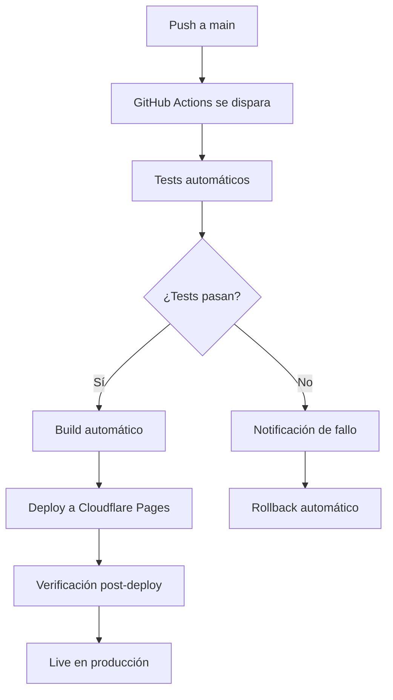

En el [post anterior](/blog/anatomia-sistema-protocolos-automaticos) vimos la implementación técnica. Ahora exploramos cómo optimizar la experiencia del usuario eliminando fricción innecesaria del workflow.

##  El Dilema: Control vs. Fluidez

### **El Problema Tradicional**
```
WORKFLOW TRADICIONAL:
1. Escribir código ️
2. Commit local 
3. Push a branch 
4. Crear PR 
5. Esperar review 
6. Aprobar PR 
7. Merge manual 
8. Deploy manual 
9. Verificar resultado 

TIEMPO TOTAL: 15-30 minutos por cambio
```

### **Mi Filosofía: UX sobre Control**

> **"Es más fácil revertir un mal PR ocasional que aprobar manualmente cientos de PRs buenos"**

##  La Solución: Auto-Merge Inteligente

### **Workflow Optimizado**
```
WORKFLOW AUTO-MERGE:
1. Escribir código ️
2. Push a main 
3.  Tomar café mientras se despliega automáticamente

TIEMPO TOTAL: 2-3 minutos
```

## ️ Arquitectura del Sistema

### **Componentes Clave**



### **GitHub Actions Workflow**

<augment_code_snippet path=".github/workflows/deploy.yml" mode="EXCERPT">
````yaml
name: Deploy to Cloudflare Pages

on:
  push:
    branches: [ main ]

jobs:
  deploy:
    runs-on: ubuntu-latest
    name: Deploy to Cloudflare Pages
    
    steps:
      - name: Checkout
        uses: actions/checkout@v4

      - name: Setup Node.js
        uses: actions/setup-node@v4
        with:
          node-version: '18'
          cache: 'npm'

      - name: Install dependencies
        run: npm ci

      - name: Run basic tests
        run: npm run test:unit || true

      - name: Build project
        run: npm run build

      - name: Deploy to Cloudflare Pages
        uses: cloudflare/pages-action@v1
        with:
          apiToken: ${{ secrets.CLOUDFLARE_API_TOKEN }}
          accountId: ${{ secrets.CLOUDFLARE_ACCOUNT_ID }}
          projectName: cappato-blog
          directory: dist
````
</augment_code_snippet>

## ️ Salvaguardas Inteligentes

### **1. Testing Automático Robusto**

<augment_code_snippet path=".github/workflows/automated-testing.yml" mode="EXCERPT">
````yaml
jobs:
  build-and-integration:
    name: Build & Integration Tests
    runs-on: ubuntu-latest
    
    steps:
    - name: Run build
      run: npm run build
      
    - name: Test build artifacts
      run: npm run test:build
      
    - name: Test XML validation
      run: npm run test:xml
      
    - name: Test content validation
      run: npm run test:content
````
</augment_code_snippet>

### **2. Validación Multi-Capa**

```bash
# Tests que se ejecutan automáticamente:
npm run test:unit        # Tests unitarios
npm run test:build       # Validación de build
npm run test:content     # Validación de contenido
npm run test:xml         # Validación de XML/RSS
npm run test:endpoints   # Tests de endpoints
```

### **3. Rollback Automático**

```javascript
// Si algo falla, rollback inmediato
if (deploymentFailed) {
  await rollbackToPreviousVersion();
  await notifyTeam('Deployment failed, rolled back automatically');
}
```

##  Beneficios Obtenidos

### **Velocidad Extrema**
-  **Deploy en ~2 minutos** desde push
-  **0 clicks manuales** para deploy normal
-  **Feedback inmediato** en caso de errores

### **Calidad Mantenida**
-  **Tests automáticos** en cada deploy
- ️ **Validación multi-capa** antes de producción
-  **Rollback automático** si algo falla

### **Experiencia del Desarrollador**
-  **Menos fricción cognitiva** - focus en código
-  **Feedback loop más corto** - errores detectados rápido
-  **Confianza en el sistema** - funciona consistentemente

## ️ Cuándo NO Usar Auto-Merge

### **Proyectos Críticos**
- Sistemas financieros
- Infraestructura crítica
- Aplicaciones médicas

### **Equipos Grandes**
- +10 desarrolladores
- Múltiples stakeholders
- Procesos de compliance estrictos

### **Código Legacy**
- Sin tests automáticos
- Arquitectura frágil
- Dependencias complejas

##  Implementación Práctica

### **Paso 1: Setup Básico**

```bash
# 1. Configurar GitHub Actions
mkdir -p .github/workflows

# 2. Configurar secrets en GitHub
# CLOUDFLARE_API_TOKEN
# CLOUDFLARE_ACCOUNT_ID

# 3. Configurar scripts de testing
npm run test:setup
```

### **Paso 2: Configurar Auto-Deploy**

<augment_code_snippet path="package.json" mode="EXCERPT">
````json
{
  "scripts": {
    "build": "astro build",
    "deploy": "npm run build && npx wrangler pages deploy dist",
    "test:all": "npm run test:unit && npm run test:build && npm run test:content"
  }
}
````
</augment_code_snippet>

### **Paso 3: Validar el Sistema**

```bash
# Test completo del workflow
git add .
git commit -m " Setup auto-merge system"
git push origin main

# Monitorear en GitHub Actions
# Verificar deploy en Cloudflare Pages
```

##  Lecciones Aprendidas

### **1. La Confianza se Construye Gradualmente**
- Empezar con proyectos pequeños
- Incrementar automatización progresivamente
- Monitorear métricas de calidad

### **2. Los Tests Son Tu Red de Seguridad**
- Invertir tiempo en tests robustos
- Automatizar validaciones críticas
- Fallar rápido y con información clara

### **3. El Rollback Debe Ser Más Rápido que el Deploy**
- Automatizar rollback completo
- Mantener versiones anteriores disponibles
- Notificaciones inmediatas de problemas

##  Próximo en la Serie

En el siguiente post veremos **"Migración de Sistemas: Preservando la Visión"** - cómo evolucionar sistemas existentes sin perder la esencia original.

### **Serie Completa:**
1.  [El Problema de los Protocolos que se Olvidan](/blog/protocolos-automaticos-ia-arquitectura)
2.  [Anatomía de un Sistema de Protocolos Automáticos](/blog/anatomia-sistema-protocolos-automaticos)
3.  **Auto-Merge Inteligente: UX sobre Control** (este post)
4.  Migración de Sistemas: Preservando la Visión (próximo)

---

**¿Te ha resultado útil esta guía?** ¡Compártela y déjanos tus comentarios!
