En el [post anterior](/blog/anatomia-sistema-protocolos-automaticos) vimos la implementación técnica. Ahora exploramos cómo optimizar la experiencia del usuario eliminando fricción innecesaria del workflow.

## 🎯 El Dilema: Control vs. Fluidez

### **El Problema Tradicional**
```
WORKFLOW TRADICIONAL:
1. Escribir código ✍️
2. Commit local 📝
3. Push a branch 🚀
4. Crear PR 📋
5. Esperar review 👀
6. Aprobar PR ✅
7. Merge manual 🔀
8. Deploy manual 🚀
9. Verificar resultado ✅

TIEMPO TOTAL: 15-30 minutos por cambio
```

### **Mi Filosofía: UX sobre Control**

> **"Es más fácil revertir un mal PR ocasional que aprobar manualmente cientos de PRs buenos"**

## 🚀 La Solución: Auto-Merge Inteligente

### **Workflow Optimizado**
```
WORKFLOW AUTO-MERGE:
1. Escribir código ✍️
2. Push a main 🚀
3. ☕ Tomar café mientras se despliega automáticamente

TIEMPO TOTAL: 2-3 minutos
```

## 🏗️ Arquitectura del Sistema

### **Componentes Clave**

```mermaid
graph TD
    A[Push a main] --> B[GitHub Actions se dispara]
    B --> C[Tests automáticos]
    C --> D{¿Tests pasan?}
    D -->|Sí| E[Build automático]
    D -->|No| F[Notificación de fallo]
    E --> G[Deploy a Cloudflare Pages]
    G --> H[Verificación post-deploy]
    H --> I[✅ Live en producción]
    F --> J[🚨 Rollback automático]
```



### **GitHub Actions Workflow**

<augment_code_snippet path=".github/workflows/deploy.yml" mode="EXCERPT">
````yaml
name: Deploy to Cloudflare Pages

on:
  push:
    branches: [ main ]

jobs:
  deploy:
    runs-on: ubuntu-latest
    name: Deploy to Cloudflare Pages
    
    steps:
      - name: Checkout
        uses: actions/checkout@v4

      - name: Setup Node.js
        uses: actions/setup-node@v4
        with:
          node-version: '18'
          cache: 'npm'

      - name: Install dependencies
        run: npm ci

      - name: Run basic tests
        run: npm run test:unit || true

      - name: Build project
        run: npm run build

      - name: Deploy to Cloudflare Pages
        uses: cloudflare/pages-action@v1
        with:
          apiToken: ${{ secrets.CLOUDFLARE_API_TOKEN }}
          accountId: ${{ secrets.CLOUDFLARE_ACCOUNT_ID }}
          projectName: cappato-blog
          directory: dist
````
</augment_code_snippet>

## 🛡️ Salvaguardas Inteligentes

### **1. Testing Automático Robusto**

<augment_code_snippet path=".github/workflows/automated-testing.yml" mode="EXCERPT">
````yaml
jobs:
  build-and-integration:
    name: Build & Integration Tests
    runs-on: ubuntu-latest
    
    steps:
    - name: Run build
      run: npm run build
      
    - name: Test build artifacts
      run: npm run test:build
      
    - name: Test XML validation
      run: npm run test:xml
      
    - name: Test content validation
      run: npm run test:content
````
</augment_code_snippet>

### **2. Validación Multi-Capa**

```bash
# Tests que se ejecutan automáticamente:
npm run test:unit        # Tests unitarios
npm run test:build       # Validación de build
npm run test:content     # Validación de contenido
npm run test:xml         # Validación de XML/RSS
npm run test:endpoints   # Tests de endpoints
```

### **3. Rollback Automático**

```javascript
// Si algo falla, rollback inmediato
if (deploymentFailed) {
  await rollbackToPreviousVersion();
  await notifyTeam('Deployment failed, rolled back automatically');
}
```

## 🎯 Beneficios Obtenidos

### **Velocidad Extrema**
- ⚡ **Deploy en ~2 minutos** desde push
- 🚀 **0 clicks manuales** para deploy normal
- 🔄 **Feedback inmediato** en caso de errores

### **Calidad Mantenida**
- ✅ **Tests automáticos** en cada deploy
- 🛡️ **Validación multi-capa** antes de producción
- 🔙 **Rollback automático** si algo falla

### **Experiencia del Desarrollador**
- 😌 **Menos fricción cognitiva** - focus en código
- 🎯 **Feedback loop más corto** - errores detectados rápido
- 💪 **Confianza en el sistema** - funciona consistentemente

## ⚠️ Cuándo NO Usar Auto-Merge

### **Proyectos Críticos**
- Sistemas financieros
- Infraestructura crítica
- Aplicaciones médicas

### **Equipos Grandes**
- +10 desarrolladores
- Múltiples stakeholders
- Procesos de compliance estrictos

### **Código Legacy**
- Sin tests automáticos
- Arquitectura frágil
- Dependencias complejas

## 🔧 Implementación Práctica

### **Paso 1: Setup Básico**

```bash
# 1. Configurar GitHub Actions
mkdir -p .github/workflows

# 2. Configurar secrets en GitHub
# CLOUDFLARE_API_TOKEN
# CLOUDFLARE_ACCOUNT_ID

# 3. Configurar scripts de testing
npm run test:setup
```

### **Paso 2: Configurar Auto-Deploy**

<augment_code_snippet path="package.json" mode="EXCERPT">
````json
{
  "scripts": {
    "build": "astro build",
    "deploy": "npm run build && npx wrangler pages deploy dist",
    "test:all": "npm run test:unit && npm run test:build && npm run test:content"
  }
}
````
</augment_code_snippet>

### **Paso 3: Validar el Sistema**

```bash
# Test completo del workflow
git add .
git commit -m "🚀 Setup auto-merge system"
git push origin main

# Monitorear en GitHub Actions
# Verificar deploy en Cloudflare Pages
```

## 💡 Lecciones Aprendidas

### **1. La Confianza se Construye Gradualmente**
- Empezar con proyectos pequeños
- Incrementar automatización progresivamente
- Monitorear métricas de calidad

### **2. Los Tests Son Tu Red de Seguridad**
- Invertir tiempo en tests robustos
- Automatizar validaciones críticas
- Fallar rápido y con información clara

### **3. El Rollback Debe Ser Más Rápido que el Deploy**
- Automatizar rollback completo
- Mantener versiones anteriores disponibles
- Notificaciones inmediatas de problemas

## 🔄 Próximo en la Serie

En el siguiente post veremos **"Migración de Sistemas: Preservando la Visión"** - cómo evolucionar sistemas existentes sin perder la esencia original.

### **Serie Completa:**
1. ✅ [El Problema de los Protocolos que se Olvidan](/blog/protocolos-automaticos-ia-arquitectura)
2. ✅ [Anatomía de un Sistema de Protocolos Automáticos](/blog/anatomia-sistema-protocolos-automaticos)
3. ✅ **Auto-Merge Inteligente: UX sobre Control** (este post)
4. 🔄 Migración de Sistemas: Preservando la Visión (próximo)

---

**¿Te ha resultado útil esta guía?** ¡Compártela y déjanos tus comentarios!
